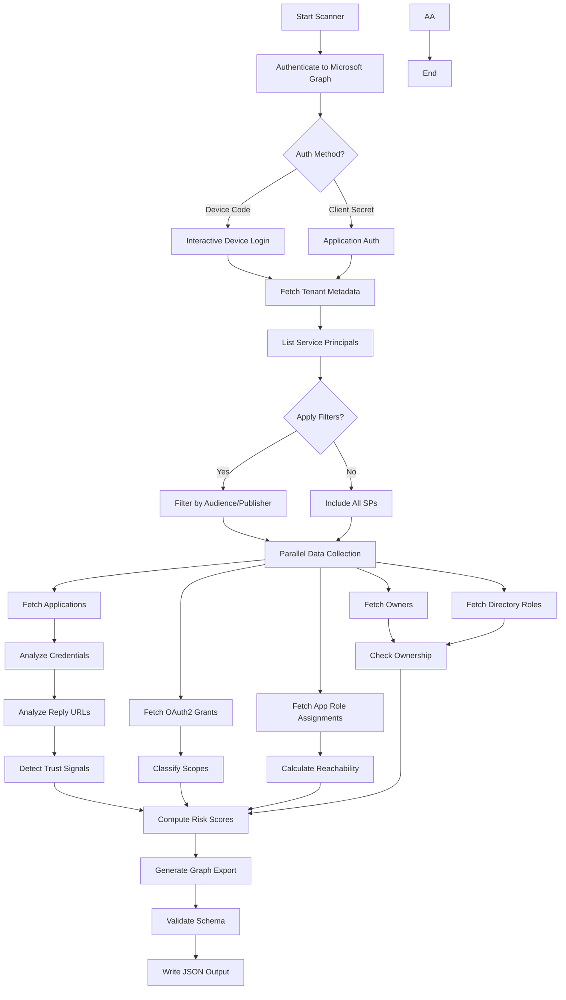
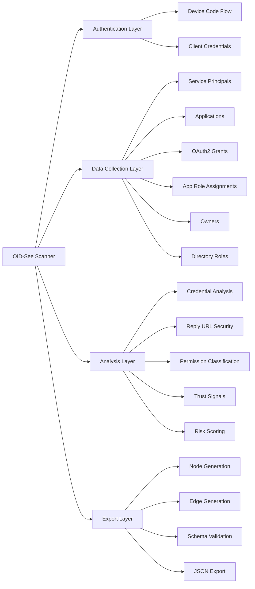
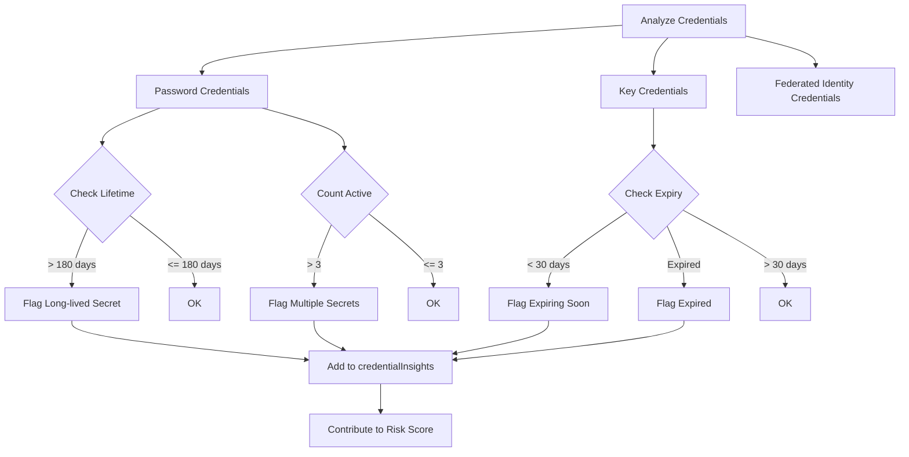
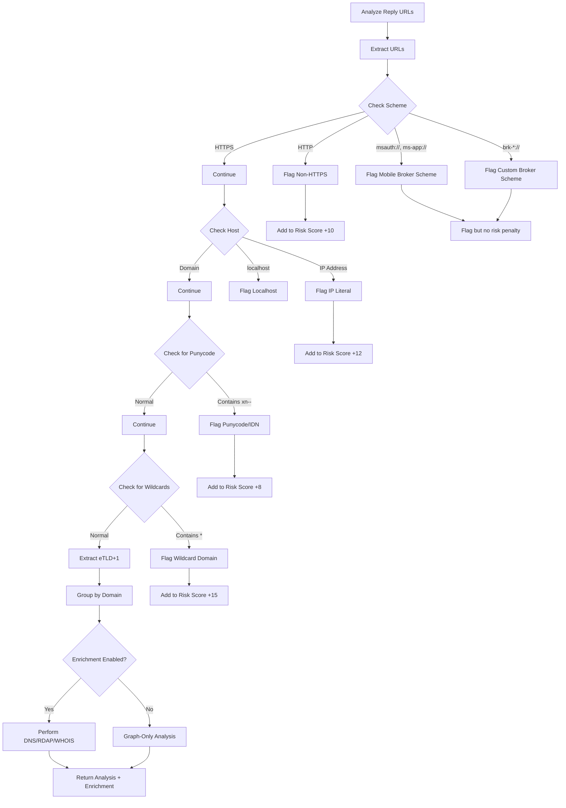
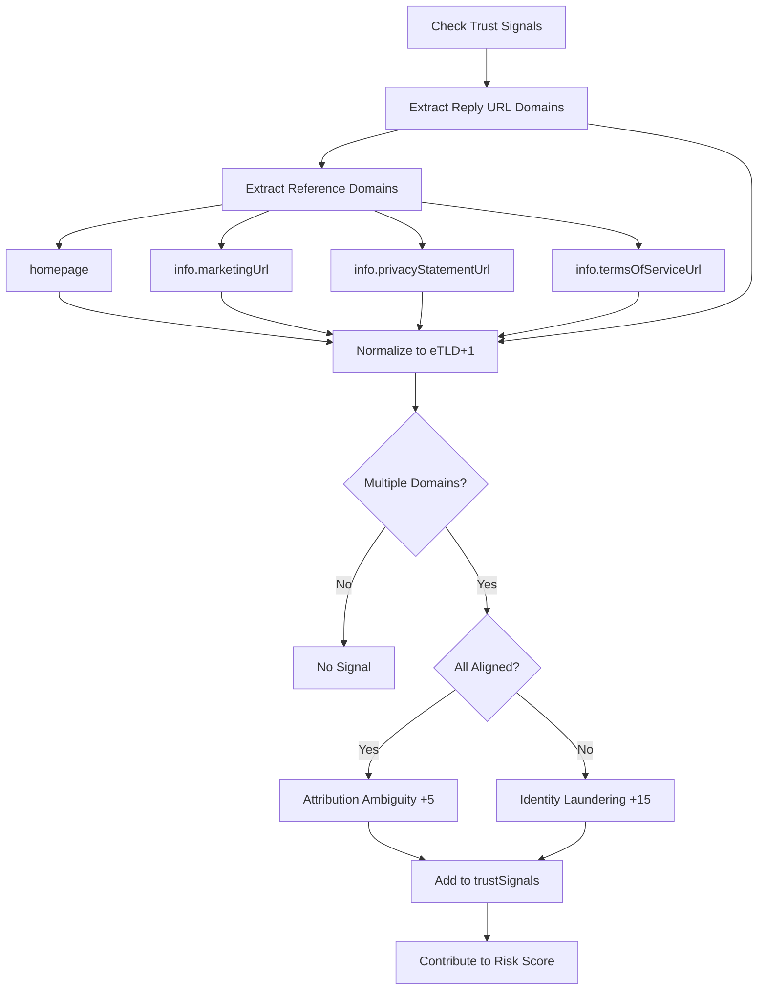
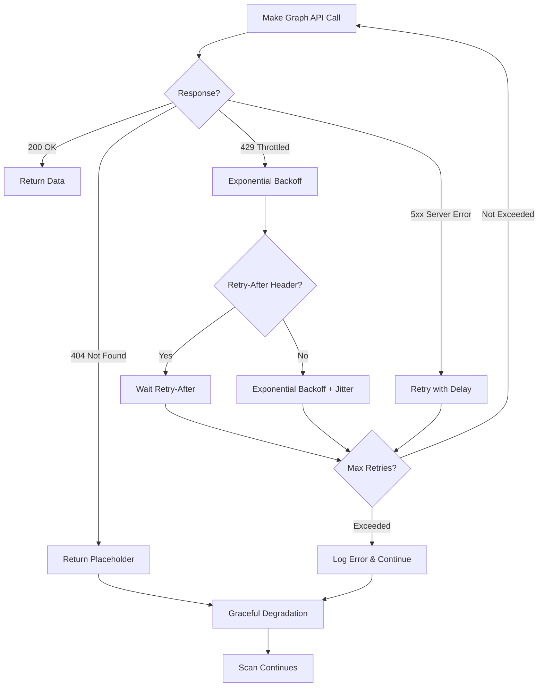

# OID-See Scanner Documentation

## Overview

The OID-See Scanner is a comprehensive Microsoft Graph scanner that analyzes your Entra ID (Azure AD) tenant to identify security risks in third-party and multi-tenant applications. It produces a structured JSON export compatible with the OID-See visualization tool.

**Data Collection Approach**:
- **Primary Source**: Microsoft Graph is the single source of truth for identity and permissions data (service principals, applications, OAuth grants, role assignments, users, groups, owners, etc.)
- **Optional Enrichment**: External lookups (DNS, RDAP, IP WHOIS) provide additional context to reduce false positives and identify outlier domains in reply URLs
- **Graph-Only Mode**: By default, the scanner uses Microsoft Graph AND enables optional enrichment. Use `--disable-all-enrichment` flag for pure Graph-only mode (no external lookups).

## Scanner Flow



## Architecture



## Key Features

### 1. Multi-Tenant Application Discovery

The scanner focuses on third-party and multi-tenant service principals by default:

- **Default Behavior**: Excludes Microsoft first-party apps and single-tenant apps
- **Configurable Filters**: Options to include first-party (`--include-first-party`) or single-tenant apps (`--include-single-tenant`)
- **Comprehensive Mode**: Use `--include-all-sps` to scan all service principals

### 2. High-Performance Data Collection

The scanner uses optimized parallel data collection with Graph API batching for maximum performance:

- **Bulk Fetching**: Application data fetched in single bulk query instead of individual queries (60-360x faster)
- **Graph API Batching**: Combines up to 20 requests per HTTP call using Microsoft Graph `$batch` endpoint (12-18x faster)
- **Parallel Workers**: 20 concurrent workers for resource loading and role definitions (2x faster)
- **Thread Safety**: All operations use proper locking mechanisms for shared caches
- **Error Resilience**: Individual failures don't stop the entire scan; automatic fallback to individual requests

**Performance Benchmarks** (8,096 service principals):
- **Total scan time**: 103 minutes → 2-3 minutes (97-98% faster)
- **Application cache**: 66 minutes → 1 minute (60-360x faster)
- **SP data collection**: 35 minutes → 30-60 seconds (12-18x faster)
- **HTTP requests**: 48,576 → 1,621 (97% reduction)

**Parallelized Operations**:
- Bulk application object fetching with in-memory filtering
- Batched OAuth2 permission grants (4-5 SPs per batch)
- Batched app role assignments (4-5 SPs per batch)
- Batched owner lookups (4-5 SPs per batch)
- Batched directory role assignments (20 SPs per batch)
- Parallel resource service principal resolution

### 3. Enhanced Security Analysis

#### Credential Hygiene Analysis

Comprehensive analysis of application credentials:



**Insights Generated**:
- Long-lived secrets (lifetime > 180 days): +10 risk points
- Expired credentials still present: +5 risk points
- Multiple active secrets (> 3): +5 risk points
- Certificates expiring within 30 days: +8 risk points

#### Reply URL Security Analysis

Detects security anomalies in OAuth2 redirect URIs:



**Detects**:
- Non-HTTPS schemes (HTTP): +10 risk points
- IP literal addresses: +12 risk points
- Punycode domains (potential homograph attacks): +8 risk points
- Wildcard domains: +15 risk points
- Localhost configurations (dev/test in production)
- Mobile broker schemes (msauth://, ms-app://, brk-*://) - flagged for analysis but no risk penalty (legitimate for mobile apps)

**Brokered Authentication**:
- **msauth://**, **ms-app://**: Microsoft Authenticator and platform broker schemes for iOS/Android
- **brk-*://**: Custom broker schemes following the pattern brk-{identifier}://
- These schemes are recognized and flagged for visibility but do not contribute to risk scores as they are legitimate for native mobile applications

**Enrichment Impact**:
When enrichment is enabled, the scanner performs:
- **DNS lookups**: Resolve domains to IP addresses to verify ownership patterns
- **RDAP queries**: Retrieve ASN and network ownership information
- **IP WHOIS**: Lookup ownership for IP literals

Enrichment helps reduce false positives by confirming that multi-domain reply URLs belong to the same organization (e.g., Microsoft service principals often have reply URLs across multiple Microsoft-owned domains).

#### Trust Signal Detection

Identifies identity laundering and attribution issues:



**Signals**:
- **Identity Laundering** (+15): Reply URLs use domains not aligned with declared identity
- **Attribution Ambiguity** (+5): Multiple legitimate domains but may cause confusion

### 4. Permission Resolution

OAuth2 scopes and app roles are resolved to human-readable details:

- **OAuth2 Scopes**: displayName, description, consent information
- **App Roles**: displayName, description, allowed member types
- **Resource Identification**: Clear identification of the resource API

### 5. Robust Error Handling



**Error Handling Features**:
- **Throttling**: Automatic exponential backoff with jitter for 429/503 responses
- **Retry-After**: Honors `Retry-After` header when present
- **Network Errors**: Retries up to `--max-retries` (default: 6)
- **Missing Objects**: 404 errors use placeholders to keep scan running
- **Batch Operations**: `/directoryObjects/getByIds` handles missing entries gracefully

## Data Collection Process

### Phase 1: Authentication

```python
# Device Code (Interactive)
python oidsee_scanner.py --tenant-id "<TENANT_ID>" --out oidsee-export.json

# Client Secret (Application)
python oidsee_scanner.py \
  --tenant-id "<TENANT_ID>" \
  --client-id "<APP_ID>" \
  --client-secret "<SECRET>" \
  --out oidsee-export.json
```

### Phase 2: Service Principal Discovery

1. **List Service Principals**: Fetch all SPs using Microsoft Graph
2. **Apply Filters**: Based on `signInAudience` and publisher
3. **Cache Results**: Store in memory for efficient access

### Phase 3: Parallel Data Collection

For each service principal, the scanner fetches (in parallel):

1. **In-Tenant Application**: Best-effort lookup of the app registration
2. **OAuth2 Grants**: Delegated permissions granted to the app
3. **App Role Assignments**: Application permissions (app roles)
4. **Assignments**: Users/groups with access to the app
5. **Owners**: Application/SP owners
6. **Directory Roles**: Directory roles assigned to the SP

### Phase 4: Analysis and Enrichment

1. **Credential Analysis**: Check password/key/federated credentials
2. **Reply URL Analysis**: Security check of redirect URIs
3. **Permission Classification**: Categorize scopes as regular/privileged/broad
4. **Trust Signals**: Detect identity laundering and domain mismatches
5. **Public Client Detection**: Identify public client and implicit flows

### Phase 5: Risk Scoring

See [Scoring Logic Documentation](scoring-logic.md) for detailed risk calculation.

### Phase 6: Export Generation

1. **Generate Nodes**: Create node objects for all entities
2. **Generate Edges**: Create edges representing relationships
3. **Validate Schema**: Ensure output matches schema
4. **Write JSON**: Output to specified file

## Command-Line Options

### Required Options

- `--tenant-id`: Target tenant GUID (required)

### Authentication Options

- `--device-code-client-id`: Public client for device code (default: Azure CLI)
- `--client-id`: Application ID for client credentials
- `--client-secret`: Application secret for client credentials

### Filtering Options

- `--include-first-party`: Include Microsoft-owned first-party apps
- `--include-single-tenant`: Include `AzureADMyOrg` audience apps
- `--include-all-sps`: Disable all filters; include all service principals

### Output Options

- `--out`: Output file path (default: `oidsee-export.json`)
- `--generate-report`: Generate an HTML report alongside the JSON export

**Example with report generation**:
```bash
# Generate both JSON export and HTML report
python oidsee_scanner.py --tenant-id "TENANT_ID" --generate-report --out scan.json

# This will create:
# - scan.json (JSON export for visualization tool)
# - scan-report.html (HTML report with risk summary)
```

The HTML report provides:
- Risk level distribution (Critical, High, Medium, Low, Info)
- Key security metrics and statistics
- Top risk contributors across all applications
- List of high-risk applications requiring immediate attention
- Capability analysis (permissions, roles, scopes)
- Security recommendations based on findings

The report is aligned with OIDSEE's scoring logic as documented in [Scoring Logic Documentation](scoring-logic.md).

### Performance Options

- `--max-retries`: Maximum HTTP retries (default: 6)
- `--retry-base-delay`: Base delay for exponential backoff in seconds (default: 0.8)

### Enrichment Options

**Note**: Enrichment is **enabled by default** (requires `dnspython` and `ipwhois` packages). Use disable flags to run in Graph-only mode.

**Default behavior** (enrichment enabled):
```bash
# DNS, RDAP, and IP WHOIS enrichment enabled by default
python oidsee_scanner.py --tenant-id "TENANT_ID" --out scan.json

# Install enrichment dependencies if not already installed
pip install dnspython ipwhois
```

**Disable specific enrichment methods**:
- `--disable-all-enrichment`: Disable all enrichment lookups (Graph-only mode)
- `--disable-dns-enrichment`: Disable DNS lookups for reply URL domains
- `--disable-rdap-enrichment`: Disable RDAP lookups for domain registration
- `--disable-ipwhois-enrichment`: Disable IP WHOIS lookups for IP literals

**Enrichment Methods**:
1. **DNS Lookups**: Resolve reply URL domains to IP addresses to verify domain ownership patterns
2. **RDAP (Registration Data Access Protocol)**: Query domain registration data including ASN, network ownership, and country codes
3. **IP WHOIS**: Lookup ownership information for IP literals in reply URLs

**Use Cases for Enrichment**:
- Identify reply URLs pointing to domains outside the vendor's expected infrastructure
- Reduce false positives by confirming multi-domain reply URLs belong to the same organization
- Detect potential domain squatting or typosquatting in reply URLs
- Verify ASN and network ownership for compliance and risk assessment

**Example with selective enrichment**:
```bash
# Enable only DNS lookups (fastest)
python oidsee_scanner.py --tenant-id "TENANT_ID" \
  --disable-rdap-enrichment \
  --disable-ipwhois-enrichment \
  --out scan.json

# Graph-only mode (no external lookups)
python oidsee_scanner.py --tenant-id "TENANT_ID" \
  --disable-all-enrichment \
  --out scan.json
```

## Report Generation

The scanner can generate an HTML report that summarizes security findings and risk metrics. This report is designed for executive summaries, compliance documentation, and security review workflows.

### Generating Reports During Scan

Use the `--generate-report` flag to generate an HTML report alongside the JSON export:

```bash
python oidsee_scanner.py --tenant-id "TENANT_ID" --generate-report --out scan.json
```

This creates:
- `scan.json` - Full JSON export for the visualization tool
- `scan-report.html` - HTML report with risk summary and metrics

### Generating Reports from Existing JSON Export

You can also generate reports from existing JSON exports using the standalone report generator:

```bash
python report_generator.py oidsee-export.json report.html
```

If you omit the output filename, it will automatically create `oidsee-export-report.html`.

### Report Contents

The HTML report includes:

1. **Executive Summary**
   - Tenant information and scan metadata
   - Total service principals scanned

2. **Risk Distribution**
   - Count and percentage of apps by risk level (Critical, High, Medium, Low, Info)
   - Visual risk cards with color coding

3. **Key Security Metrics**
   - Unverified publishers
   - Apps without owners
   - Credential hygiene issues (password credentials, long-lived secrets, expired credentials)
   - Identity laundering detection
   - Governance gaps (no assignment required)
   - Reply URL security issues (non-HTTPS, IP literals, wildcards)

4. **Top Risk Contributors**
   - Most common risk factors across all applications
   - Percentage of apps affected by each risk factor
   - Average risk weight contribution

5. **High-Risk Applications**
   - Top 10 applications with risk scores ≥70
   - Application name, App ID, risk score, and risk level

6. **Capability Analysis**
   - Count of applications with specific capabilities:
     - Impersonation capability
     - Application roles (app permissions)
     - Privileged scopes
     - Overly broad scopes
     - Offline access (refresh tokens)
     - Directory roles

7. **Security Recommendations**
   - Actionable recommendations based on detected issues
   - Prioritized by impact and ease of remediation

### Report Alignment with OIDSEE Scoring

The report metrics are directly aligned with OIDSEE's scoring logic as documented in [Scoring Logic Documentation](scoring-logic.md). All risk factors, weights, and thresholds match the scanner's risk calculation algorithm.

**Risk Level Mapping**:
- **Critical (90-100)**: Severe risk requiring urgent action
- **High (70-89)**: Significant risk requiring immediate review
- **Medium (40-69)**: Notable risk to investigate soon
- **Low (20-39)**: Some concerns to review periodically
- **Info (0-19)**: Minimal risk, routine monitoring

### Use Cases

**Executive Reporting**:
- Share HTML report with leadership for security posture overview
- Include in security review presentations
- Track risk trends over time

**Compliance Documentation**:
- Document third-party application risks for audits
- Evidence of security controls and monitoring
- Risk acceptance documentation

**Security Operations**:
- Prioritize remediation efforts based on risk distribution
- Track progress on security improvements
- Communicate findings to application owners

**Automation**:
```bash
# Scheduled scan with report (cron example)
0 2 * * 1 python3 /path/to/oidsee_scanner.py \
  --tenant-id "$TENANT_ID" \
  --client-id "$CLIENT_ID" \
  --client-secret "$CLIENT_SECRET" \
  --generate-report \
  --out "/reports/weekly-scan-$(date +\%Y\%m\%d).json" \
  2>&1 | logger -t oidsee-scanner
```

## Output Structure

The scanner generates a JSON file with the following structure:

```json
{
  "format": {
    "name": "oidsee-graph",
    "version": "1.0"
  },
  "generatedAt": "2024-12-26T00:00:00Z",
  "tenant": {
    "tenantId": "00000000-0000-0000-0000-000000000000",
    "displayName": "Contoso"
  },
  "nodes": [...],
  "edges": [...]
}
```

### Node Types

- **ServicePrincipal**: Third-party/multi-tenant apps
- **Application**: In-tenant app registrations
- **User**: Users in the tenant
- **Group**: Security/Microsoft 365 groups
- **Role**: Directory roles
- **ResourceApi**: Resource applications (e.g., Microsoft Graph)

### Edge Types

**Structural Edges**:
- `INSTANCE_OF`: SP → Application relationship
- `OWNS`: User/Group → Application/SP
- `MEMBER_OF`: User → Group

**Permission Edges**:
- `HAS_SCOPES`: Regular delegated permissions
- `HAS_PRIVILEGED_SCOPES`: Write/privileged delegated permissions
- `HAS_TOO_MANY_SCOPES`: Overly broad delegated permissions (*.All)
- `HAS_APP_ROLE`: Application permissions (app roles)
- `CAN_IMPERSONATE`: Explicit impersonation capability
- `HAS_OFFLINE_ACCESS`: Persistence via refresh tokens

**Assignment Edges**:
- `ASSIGNED_TO`: User/Group → Application assignment
- `HAS_ROLE`: SP → Directory role assignment

## Microsoft-Specific Cases

The scanner recognizes and handles several Microsoft-specific patterns:

### Microsoft Service Principals

**First-Party Apps**: The scanner uses [Merill Fernando's Microsoft Apps list](https://github.com/merill/microsoft-info) to identify Microsoft first-party applications.

**Multi-Domain Reply URLs**: Microsoft service principals often have reply URLs across multiple Microsoft-owned domains (e.g., login.microsoftonline.com, login.windows.net, aadcdn.msauth.net). When enrichment is enabled, the scanner can verify these belong to Microsoft infrastructure via ASN/network ownership checks.

**Wildcard Reply URLs**: Some Microsoft apps use wildcard domains (e.g., `https://*.office.com/callback`). These are flagged for visibility but may be expected for Microsoft apps serving multiple subdomains.

### Known Microsoft Tenant IDs

The scanner recognizes Microsoft tenant IDs to avoid false positives for identity laundering:
- `f8cdef31-a31e-4b4a-93e4-5f571e91255a` - Microsoft Accounts (MSA)
- `72f988bf-86f1-41af-91ab-2d7cd011db47` - Microsoft Services
- `cdc5aeea-15c5-4db6-b079-fcadd2505dc2` - Microsoft third tenant

Apps from these tenants with verified publishers are not flagged for identity laundering.

### Brokered Authentication Schemes

Native mobile applications often use broker schemes for authentication:
- **msauth://**: iOS/Android Microsoft Authenticator broker
- **ms-app://**: Universal Windows Platform (UWP) app scheme
- **brk-*://**: Custom broker pattern (e.g., brk-com.contoso.myapp://)

These are recognized as legitimate and don't contribute to risk scores, though they are tracked in the `schemes` field of `replyUrlAnalysis`.

### Platform-Specific Patterns

The scanner identifies platform-specific reply URL patterns:
- **localhost with ports**: Common for development (e.g., `http://localhost:8080/callback`)
- **Mobile deep links**: Custom schemes for iOS/Android apps
- **SPA redirect URIs**: Single-page application patterns (often with `spa` in the URL)

## Performance Characteristics

### Typical Scan Times

- **Small Tenant** (< 50 apps): 30-60 seconds
- **Medium Tenant** (50-200 apps): 2-5 minutes
- **Large Tenant** (200-1000 apps): 5-15 minutes
- **Very Large Tenant** (> 1000 apps): 15-30+ minutes

*Times vary based on network latency, API throttling, tenant characteristics, and whether enrichment is enabled*

### Optimization Tips

1. **Use Application Auth**: Client credentials are faster than device code
2. **Filter Appropriately**: Use filters to scan only what you need
3. **Increase Retry Delay**: For heavily throttled tenants, increase `--retry-base-delay`
4. **Disable Enrichment**: Use `--disable-all-enrichment` for fastest scans (Graph-only mode)
4. **Monitor Progress**: Check stderr logs for category-level progress

## Troubleshooting

### Common Issues

#### 1. Throttling (429 Errors)

**Symptom**: Frequent 429 errors, slow progress

**Solution**:
```bash
python oidsee_scanner.py \
  --tenant-id "<TENANT_ID>" \
  --max-retries 10 \
  --retry-base-delay 1.5
```

#### 2. Missing Permissions

**Symptom**: 403 Forbidden errors

**Required Permissions**:
- `Application.Read.All`
- `Directory.Read.All`

#### 3. Authentication Timeout

**Symptom**: Device code times out

**Solution**: Use client credentials instead of device code

#### 4. Large Export Files

**Symptom**: JSON file is too large

**Solution**: Use filters to reduce scope or process in batches

## Security Considerations

### Permissions Required

The scanner requires read-only permissions:

- **Application.Read.All**: Read application and service principal data
- **Directory.Read.All**: Read directory data (users, groups, roles)

### Data Handling

- **No Data Transmission**: All processing happens locally; no data sent to external services except Microsoft Graph
- **Optional External Lookups**: When enrichment is enabled, DNS/RDAP/WHOIS queries are sent to public DNS servers and RDAP/WHOIS services
- **No External APIs**: Only connects to Microsoft Graph (and optionally DNS/RDAP/WHOIS when enrichment is enabled)
- **Credential Security**: Client secrets are not logged or stored
- **Output Sensitivity**: JSON export contains tenant data - handle appropriately

### Best Practices

1. **Least Privilege**: Use a service account with minimum required permissions
2. **Secure Storage**: Store output files securely
3. **Regular Scans**: Run periodically to monitor changes
4. **Audit Logs**: Enable audit logging for scanner service principal
5. **Credential Rotation**: Rotate client secrets regularly

## Integration

### Using with OID-See Viewer

1. **Generate Export**: Run scanner to create JSON file
2. **Load in Viewer**: Open OID-See web app
3. **Import Data**: Use JSON Editor to load your export
4. **Analyze**: Use filters, lenses, and graph exploration

### Automation

```bash
# Scheduled scan example (cron)
0 2 * * * /usr/bin/python3 /path/to/oidsee_scanner.py \
  --tenant-id "$TENANT_ID" \
  --client-id "$CLIENT_ID" \
  --client-secret "$CLIENT_SECRET" \
  --out "/exports/oidsee-$(date +\%Y\%m\%d).json" \
  2>&1 | logger -t oidsee-scanner
```

### CI/CD Integration

```yaml
# Azure DevOps example
- task: PythonScript@0
  inputs:
    scriptSource: 'filePath'
    scriptPath: 'oidsee_scanner.py'
    arguments: |
      --tenant-id $(TenantId)
      --client-id $(ClientId)
      --client-secret $(ClientSecret)
      --out $(Build.ArtifactStagingDirectory)/oidsee-export.json
```

## Next Steps

- **[Scoring Logic Documentation](scoring-logic.md)**: Understand risk calculation
- **[Export Schema Documentation](schema.md)**: Learn about the data structure
- **[Web App Documentation](webapp.md)**: Explore the visualization tool
