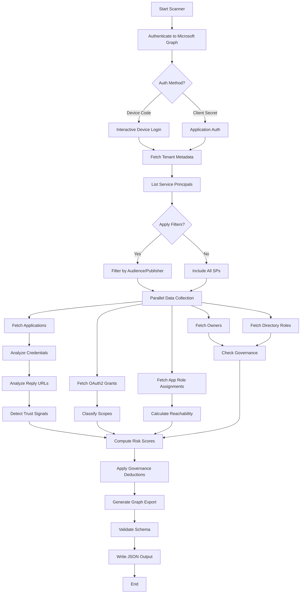
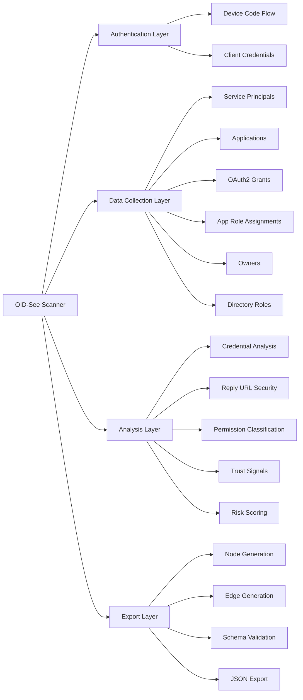
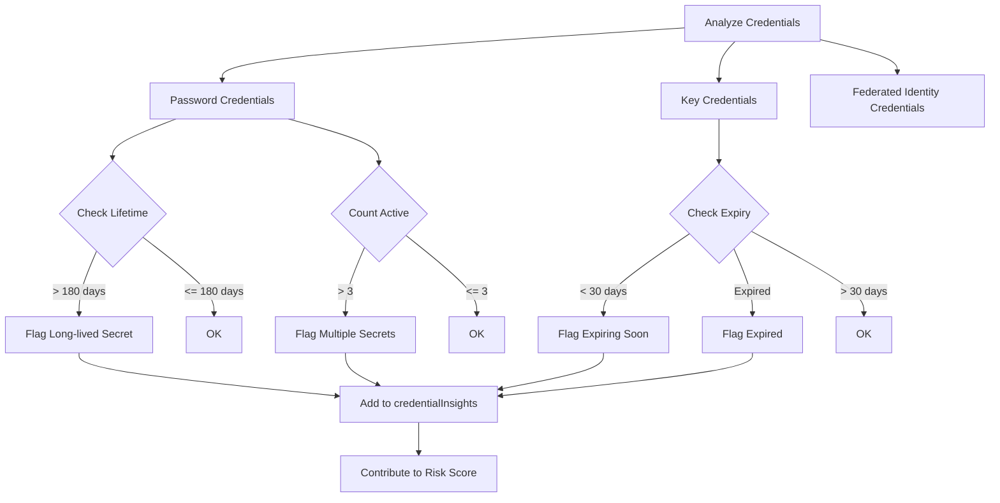
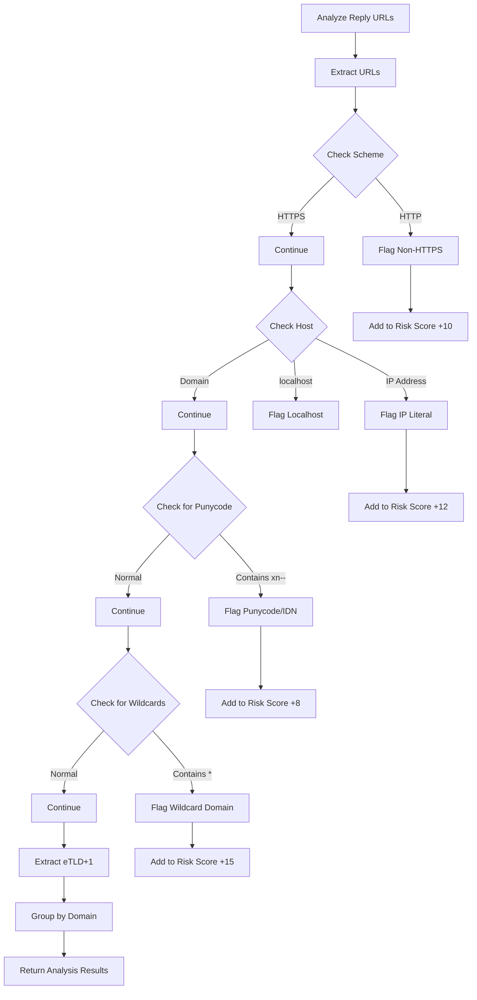
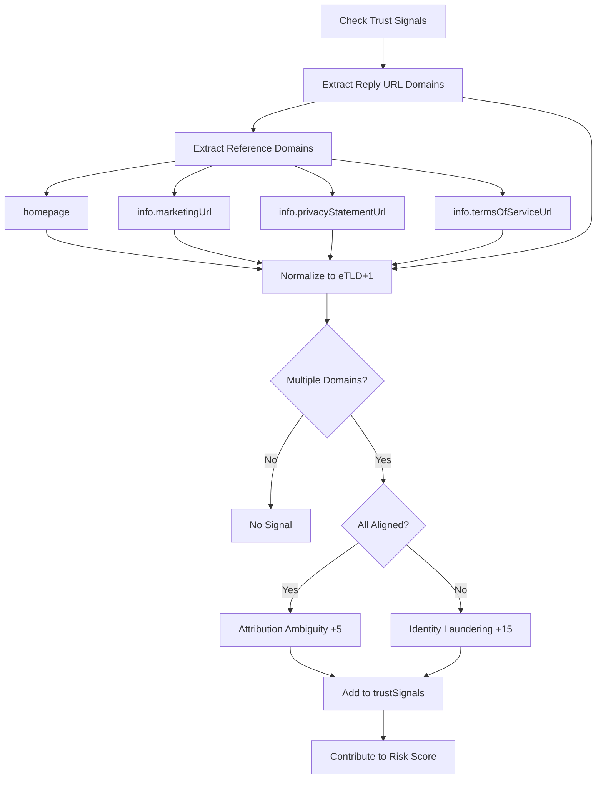
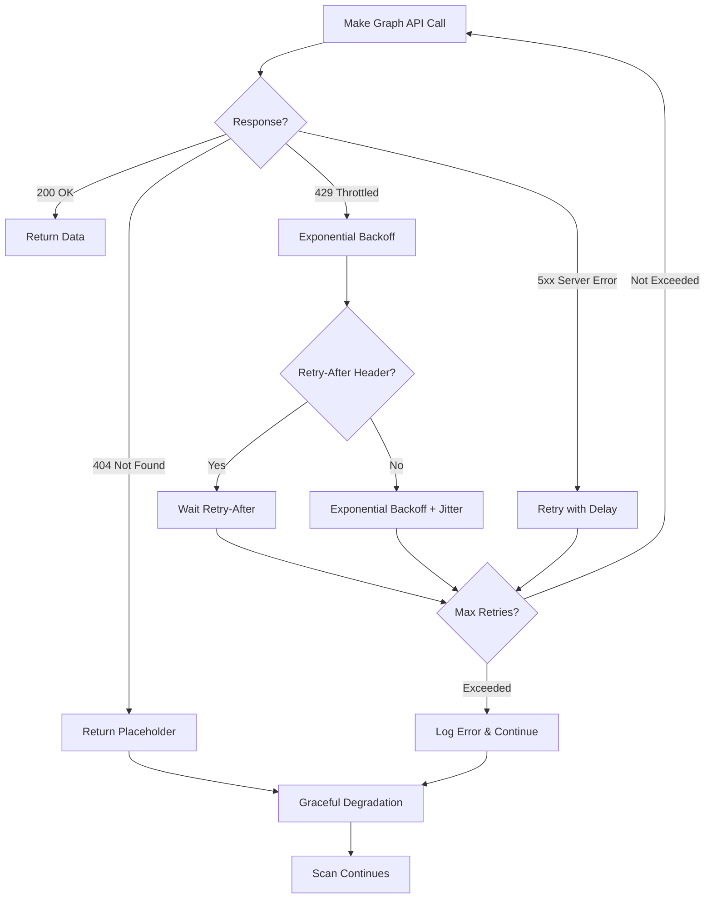

# OID-See Scanner Documentation

## Overview

The OID-See Scanner is a comprehensive Microsoft Graph scanner that analyzes your Entra ID (Azure AD) tenant to identify security risks in third-party and multi-tenant applications. It produces a structured JSON export compatible with the OID-See visualization tool.

## Scanner Flow



## Architecture



## Key Features

### 1. Multi-Tenant Application Discovery

The scanner focuses on third-party and multi-tenant service principals by default:

- **Default Behavior**: Excludes Microsoft first-party apps and single-tenant apps
- **Configurable Filters**: Options to include first-party (`--include-first-party`) or single-tenant apps (`--include-single-tenant`)
- **Comprehensive Mode**: Use `--include-all-sps` to scan all service principals

### 2. Parallel Data Collection

The scanner uses Python's `ThreadPoolExecutor` to fetch data in parallel:

- **Performance**: Up to 10x faster than sequential collection
- **Thread Safety**: All operations use proper locking mechanisms
- **Error Resilience**: Individual failures don't stop the entire scan

**Parallelized Operations**:
- Application object fetching
- OAuth2 permission grants
- App role assignments
- Owner lookups
- Directory role assignments
- Resource service principal resolution

### 3. Enhanced Security Analysis

#### Credential Hygiene Analysis

Comprehensive analysis of application credentials:



**Insights Generated**:
- Long-lived secrets (lifetime > 180 days): +10 risk points
- Expired credentials still present: +5 risk points
- Multiple active secrets (> 3): +5 risk points
- Certificates expiring within 30 days: +8 risk points

#### Reply URL Security Analysis

Detects security anomalies in OAuth2 redirect URIs:



**Detects**:
- Non-HTTPS schemes (HTTP): +10 risk points
- IP literal addresses: +12 risk points
- Punycode domains (potential homograph attacks): +8 risk points
- Wildcard domains: +15 risk points
- Localhost configurations (dev/test in production)

#### Trust Signal Detection

Identifies identity laundering and attribution issues:



**Signals**:
- **Identity Laundering** (+15): Reply URLs use domains not aligned with declared identity
- **Attribution Ambiguity** (+5): Multiple legitimate domains but may cause confusion

### 4. Permission Resolution

OAuth2 scopes and app roles are resolved to human-readable details:

- **OAuth2 Scopes**: displayName, description, consent information
- **App Roles**: displayName, description, allowed member types
- **Resource Identification**: Clear identification of the resource API

### 5. Robust Error Handling



**Error Handling Features**:
- **Throttling**: Automatic exponential backoff with jitter for 429/503 responses
- **Retry-After**: Honors `Retry-After` header when present
- **Network Errors**: Retries up to `--max-retries` (default: 6)
- **Missing Objects**: 404 errors use placeholders to keep scan running
- **Batch Operations**: `/directoryObjects/getByIds` handles missing entries gracefully

## Data Collection Process

### Phase 1: Authentication

```python
# Device Code (Interactive)
python oidsee_scanner.py --tenant-id "<TENANT_ID>" --out export.json

# Client Secret (Application)
python oidsee_scanner.py \
  --tenant-id "<TENANT_ID>" \
  --client-id "<APP_ID>" \
  --client-secret "<SECRET>" \
  --out export.json
```

### Phase 2: Service Principal Discovery

1. **List Service Principals**: Fetch all SPs using Microsoft Graph
2. **Apply Filters**: Based on `signInAudience` and publisher
3. **Cache Results**: Store in memory for efficient access

### Phase 3: Parallel Data Collection

For each service principal, the scanner fetches (in parallel):

1. **In-Tenant Application**: Best-effort lookup of the app registration
2. **OAuth2 Grants**: Delegated permissions granted to the app
3. **App Role Assignments**: Application permissions (app roles)
4. **Assignments**: Users/groups with access to the app
5. **Owners**: Application/SP owners
6. **Directory Roles**: Directory roles assigned to the SP

### Phase 4: Analysis and Enrichment

1. **Credential Analysis**: Check password/key/federated credentials
2. **Reply URL Analysis**: Security check of redirect URIs
3. **Permission Classification**: Categorize scopes as regular/privileged/broad
4. **Trust Signals**: Detect identity laundering and domain mismatches
5. **Public Client Detection**: Identify public client and implicit flows

### Phase 5: Risk Scoring

See [Scoring Logic Documentation](scoring-logic.md) for detailed risk calculation.

### Phase 6: Export Generation

1. **Generate Nodes**: Create node objects for all entities
2. **Generate Edges**: Create edges representing relationships
3. **Apply Governance**: Apply risk deductions for governed apps
4. **Validate Schema**: Ensure output matches schema
5. **Write JSON**: Output to specified file

## Command-Line Options

### Required Options

- `--tenant-id`: Target tenant GUID (required)

### Authentication Options

- `--device-code-client-id`: Public client for device code (default: Azure CLI)
- `--client-id`: Application ID for client credentials
- `--client-secret`: Application secret for client credentials

### Filtering Options

- `--include-first-party`: Include Microsoft-owned first-party apps
- `--include-single-tenant`: Include `AzureADMyOrg` audience apps
- `--include-all-sps`: Disable all filters; include all service principals

### Output Options

- `--out`: Output file path (default: `oidsee-export.json`)

### Performance Options

- `--max-retries`: Maximum HTTP retries (default: 6)
- `--retry-base-delay`: Base delay for exponential backoff in seconds (default: 0.8)

### Future Enrichment Options (Placeholders)

- `--enable-dns-enrichment`: Enable DNS lookups for reply URL domains
- `--enable-rdap-enrichment`: Enable RDAP lookups for domain registration
- `--enable-ipwhois-enrichment`: Enable IP WHOIS for IP literals

## Output Structure

The scanner generates a JSON file with the following structure:

```json
{
  "format": {
    "name": "oidsee-graph",
    "version": "1.0"
  },
  "generatedAt": "2024-12-26T00:00:00Z",
  "tenant": {
    "tenantId": "00000000-0000-0000-0000-000000000000",
    "displayName": "Contoso"
  },
  "nodes": [...],
  "edges": [...]
}
```

### Node Types

- **ServicePrincipal**: Third-party/multi-tenant apps
- **Application**: In-tenant app registrations
- **User**: Users in the tenant
- **Group**: Security/Microsoft 365 groups
- **Role**: Directory roles
- **ResourceApi**: Resource applications (e.g., Microsoft Graph)
- **TenantPolicy**: Conditional Access policies

### Edge Types

**Structural Edges**:
- `INSTANCE_OF`: SP → Application relationship
- `OWNS`: User/Group → Application/SP
- `MEMBER_OF`: User → Group

**Permission Edges**:
- `HAS_SCOPES`: Regular delegated permissions
- `HAS_PRIVILEGED_SCOPES`: Write/privileged delegated permissions
- `HAS_TOO_MANY_SCOPES`: Overly broad delegated permissions (*.All)
- `HAS_APP_ROLE`: Application permissions (app roles)
- `CAN_IMPERSONATE`: Explicit impersonation capability
- `HAS_OFFLINE_ACCESS`: Persistence via refresh tokens

**Assignment Edges**:
- `ASSIGNED_TO`: User/Group → Application assignment
- `HAS_ROLE`: SP → Directory role assignment

**Governance Edges**:
- `GOVERNS`: Conditional Access policy → Application

## Performance Characteristics

### Typical Scan Times

- **Small Tenant** (< 50 apps): 30-60 seconds
- **Medium Tenant** (50-200 apps): 2-5 minutes
- **Large Tenant** (200-1000 apps): 5-15 minutes
- **Very Large Tenant** (> 1000 apps): 15-30+ minutes

*Times vary based on network latency, API throttling, and tenant characteristics*

### Optimization Tips

1. **Use Application Auth**: Client credentials are faster than device code
2. **Filter Appropriately**: Use filters to scan only what you need
3. **Increase Retry Delay**: For heavily throttled tenants, increase `--retry-base-delay`
4. **Monitor Progress**: Check stderr logs for category-level progress

## Troubleshooting

### Common Issues

#### 1. Throttling (429 Errors)

**Symptom**: Frequent 429 errors, slow progress

**Solution**:
```bash
python oidsee_scanner.py \
  --tenant-id "<TENANT_ID>" \
  --max-retries 10 \
  --retry-base-delay 1.5
```

#### 2. Missing Permissions

**Symptom**: 403 Forbidden errors

**Required Permissions**:
- `Application.Read.All`
- `Directory.Read.All`
- `Policy.Read.All` (for Conditional Access)

#### 3. Authentication Timeout

**Symptom**: Device code times out

**Solution**: Use client credentials instead of device code

#### 4. Large Export Files

**Symptom**: JSON file is too large

**Solution**: Use filters to reduce scope or process in batches

## Security Considerations

### Permissions Required

The scanner requires read-only permissions:

- **Application.Read.All**: Read application and service principal data
- **Directory.Read.All**: Read directory data (users, groups, roles)
- **Policy.Read.All**: Read Conditional Access policies (optional)

### Data Handling

- **No Data Transmission**: All processing happens locally
- **No External APIs**: Only connects to Microsoft Graph
- **Credential Security**: Client secrets are not logged or stored
- **Output Sensitivity**: JSON export contains tenant data - handle appropriately

### Best Practices

1. **Least Privilege**: Use a service account with minimum required permissions
2. **Secure Storage**: Store output files securely
3. **Regular Scans**: Run periodically to monitor changes
4. **Audit Logs**: Enable audit logging for scanner service principal
5. **Credential Rotation**: Rotate client secrets regularly

## Integration

### Using with OID-See Viewer

1. **Generate Export**: Run scanner to create JSON file
2. **Load in Viewer**: Open OID-See web app
3. **Import Data**: Use JSON Editor to load your export
4. **Analyze**: Use filters, lenses, and graph exploration

### Automation

```bash
# Scheduled scan example (cron)
0 2 * * * /usr/bin/python3 /path/to/oidsee_scanner.py \
  --tenant-id "$TENANT_ID" \
  --client-id "$CLIENT_ID" \
  --client-secret "$CLIENT_SECRET" \
  --out "/exports/oidsee-$(date +\%Y\%m\%d).json" \
  2>&1 | logger -t oidsee-scanner
```

### CI/CD Integration

```yaml
# Azure DevOps example
- task: PythonScript@0
  inputs:
    scriptSource: 'filePath'
    scriptPath: 'oidsee_scanner.py'
    arguments: |
      --tenant-id $(TenantId)
      --client-id $(ClientId)
      --client-secret $(ClientSecret)
      --out $(Build.ArtifactStagingDirectory)/oidsee-export.json
```

## Next Steps

- **[Scoring Logic Documentation](scoring-logic.md)**: Understand risk calculation
- **[Export Schema Documentation](schema.md)**: Learn about the data structure
- **[Web App Documentation](webapp.md)**: Explore the visualization tool
