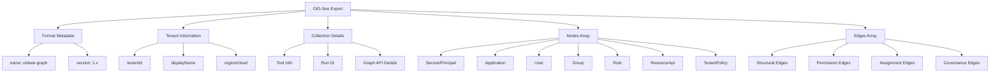
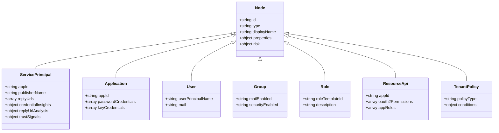
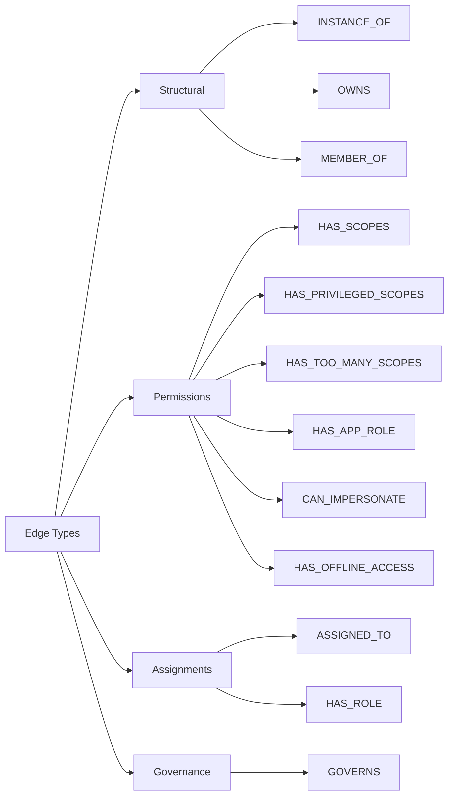

# OID-See Export Schema Documentation

## Overview

The OID-See export schema defines the structure of JSON files that contain Microsoft Entra ID (Azure AD) tenant data for visualization in the OID-See web application. This schema provides a standardized format for representing applications, service principals, users, groups, permissions, and their relationships as a graph.

**Schema Location**: `schemas/oidsee-graph-export.schema.json`

**Current Version**: 1.x (vNext)

## Schema Structure



## Top-Level Structure

```json
{
  "format": {
    "name": "oidsee-graph",
    "version": "1.0"
  },
  "generatedAt": "2024-12-26T00:00:00Z",
  "tenant": {
    "tenantId": "00000000-0000-0000-0000-000000000000",
    "displayName": "Contoso Corporation",
    "region": "US",
    "cloud": "Public"
  },
  "collection": {
    "tool": {
      "name": "oidsee_scanner.py",
      "version": "1.0.0",
      "build": "20241226"
    },
    "runId": "scan-20241226-123456",
    "graphApi": {
      "baseUrl": "https://graph.microsoft.com",
      "apiVersion": "v1.0"
    }
  },
  "nodes": [...],
  "edges": [...]
}
```

### Required Fields

- **format**: Schema identifier
  - `name`: Must be `"oidsee-graph"`
  - `version`: Version string matching pattern `^1\.(0|[1-9]\d*)(\.[0-9]+)?$`

- **generatedAt**: ISO 8601 timestamp of export generation

- **tenant**: Tenant identification
  - `tenantId`: GUID in format `^[0-9a-fA-F-]{36}$`

- **nodes**: Array of node objects

- **edges**: Array of edge objects

### Optional Fields

- **tenant.displayName**: Human-readable tenant name
- **tenant.region**: Tenant region (e.g., "US", "EU", "APAC")
- **tenant.cloud**: Cloud environment (Public, GCC, GCCHigh, DoD, China, Germany)
- **collection**: Metadata about the data collection process

## Node Types



### Base Node Structure

All nodes share common properties:

```json
{
  "id": "unique-node-identifier",
  "type": "ServicePrincipal",
  "displayName": "Human-readable name",
  "properties": {
    // Type-specific properties
  },
  "risk": {
    "score": 75,
    "level": "high",
    "reasons": [...]
  }
}
```

### ServicePrincipal Node

Represents enterprise applications and service principals.

```json
{
  "id": "sp-12345",
  "type": "ServicePrincipal",
  "displayName": "Contoso HR Portal",
  "properties": {
    "appId": "00000000-0000-0000-0000-000000000000",
    "servicePrincipalId": "11111111-1111-1111-1111-111111111111",
    "publisherName": "Contoso Ltd",
    "verifiedPublisher": {
      "displayName": "Contoso Ltd",
      "verifiedPublisherId": "12345",
      "addedDateTime": "2023-01-01T00:00:00Z"
    },
    "signInAudience": "AzureADMultipleOrgs",
    "homepage": "https://hr.contoso.com",
    "replyUrls": [
      "https://hr.contoso.com/callback"
    ],
    "appOwnerOrganizationId": "22222222-2222-2222-2222-222222222222",
    "appRoleAssignmentRequired": true,
    "preferredSingleSignOnMode": "saml",
    "tags": ["WindowsAzureActiveDirectoryIntegratedApp"],
    "info": {
      "marketingUrl": "https://contoso.com",
      "privacyStatementUrl": "https://contoso.com/privacy",
      "termsOfServiceUrl": "https://contoso.com/terms"
    },
    "createdDateTime": "2023-01-01T00:00:00Z",
    
    // Enhanced analysis results
    "credentialInsights": {
      "total_password_credentials": 1,
      "active_password_credentials": 1,
      "expired_password_credentials": 0,
      "total_key_credentials": 1,
      "active_key_credentials": 1,
      "expired_key_credentials": 0,
      "long_lived_secrets": [],
      "expired_but_present": [],
      "certificate_rollover_issues": [],
      "multiple_active_secrets": false
    },
    "replyUrlAnalysis": {
      "total_urls": 1,
      "normalized_domains": ["contoso.com"],
      "non_https_urls": [],
      "ip_literal_urls": [],
      "localhost_urls": [],
      "punycode_urls": [],
      "wildcard_urls": [],
      "schemes": ["https"]
    },
    "trustSignals": {
      "identityLaunderingSuspected": false,
      "mixedReplyUrlDomains": false,
      "nonAlignedDomains": []
    },
    "publicClientIndicators": {
      "hasPublicClientFlows": false,
      "hasImplicitFlow": false,
      "hasImplicitAccessTokenIssuance": false,
      "hasImplicitIdTokenIssuance": false,
      "hasSpaRedirectUris": false
    },
    "replyUrlEnrichment": null,
    "replyUrlProvenance": null,
    "domainWhois": null,
    "dnsRecords": null
  },
  "risk": {
    "score": 35,
    "level": "low",
    "reasons": [
      {
        "code": "HAS_SCOPES",
        "weight": 0,
        "message": "Regular delegated scopes granted"
      },
      {
        "code": "ASSIGNED_TO",
        "weight": 15,
        "message": "Assigned to 25 users"
      }
    ]
  }
}
```

**Key Properties**:

- **appId**: Application ID (globally unique across Azure AD)
- **servicePrincipalId**: Service principal object ID (tenant-specific)
- **publisherName**: Self-declared publisher name
- **verifiedPublisher**: Microsoft-verified publisher information (if verified)
- **signInAudience**: Audience type
  - `AzureADMyOrg`: Single-tenant
  - `AzureADMultipleOrgs`: Multi-tenant
  - `AzureADandPersonalMicrosoftAccount`: Multi-tenant + personal accounts
- **replyUrls**: OAuth2 redirect URIs
- **credentialInsights**: Analysis of credentials (secrets, certificates)
- **replyUrlAnalysis**: Security analysis of redirect URIs
- **trustSignals**: Identity laundering and attribution signals
- **publicClientIndicators**: Public client and implicit flow detection

**Placeholder Fields** (for future enrichment):
- **replyUrlEnrichment**: DNS/RDAP/IPWHOIS data (currently null)
- **replyUrlProvenance**: Enrichment provenance metadata (currently null)
- **domainWhois**: WHOIS data for domains (currently null)
- **dnsRecords**: DNS records for domains (currently null)

### Application Node

Represents app registrations in the tenant.

```json
{
  "id": "app-67890",
  "type": "Application",
  "displayName": "Contoso HR Portal Registration",
  "properties": {
    "appId": "00000000-0000-0000-0000-000000000000",
    "applicationId": "33333333-3333-3333-3333-333333333333",
    "passwordCredentials": [
      {
        "keyId": "44444444-4444-4444-4444-444444444444",
        "displayName": "Production Secret",
        "startDateTime": "2024-01-01T00:00:00Z",
        "endDateTime": "2024-12-31T23:59:59Z"
      }
    ],
    "keyCredentials": [
      {
        "keyId": "55555555-5555-5555-5555-555555555555",
        "type": "AsymmetricX509Cert",
        "usage": "Verify",
        "displayName": "Production Certificate",
        "startDateTime": "2024-01-01T00:00:00Z",
        "endDateTime": "2025-12-31T23:59:59Z"
      }
    ],
    "federatedIdentityCredentials": []
  }
}
```

**Key Properties**:
- **appId**: Application ID (matches ServicePrincipal appId)
- **applicationId**: Application object ID
- **passwordCredentials**: Client secrets with validity periods
- **keyCredentials**: X.509 certificates for authentication
- **federatedIdentityCredentials**: Workload identity federation configurations

### User Node

Represents users in the tenant.

```json
{
  "id": "user-11111",
  "type": "User",
  "displayName": "John Doe",
  "properties": {
    "userPrincipalName": "john.doe@contoso.com",
    "mail": "john.doe@contoso.com",
    "objectId": "66666666-6666-6666-6666-666666666666",
    "userType": "Member",
    "accountEnabled": true
  }
}
```

### Group Node

Represents security and Microsoft 365 groups.

```json
{
  "id": "group-22222",
  "type": "Group",
  "displayName": "HR Administrators",
  "properties": {
    "objectId": "77777777-7777-7777-7777-777777777777",
    "mailEnabled": false,
    "securityEnabled": true,
    "groupTypes": [],
    "membershipRule": null
  }
}
```

### Role Node

Represents directory roles (e.g., Global Administrator, Application Administrator).

```json
{
  "id": "role-33333",
  "type": "Role",
  "displayName": "Application Administrator",
  "properties": {
    "roleTemplateId": "88888888-8888-8888-8888-888888888888",
    "description": "Can manage all aspects of app registrations and enterprise apps.",
    "isBuiltIn": true,
    "isEnabled": true
  }
}
```

### ResourceApi Node

Represents resource applications that expose permissions (e.g., Microsoft Graph).

```json
{
  "id": "resource-44444",
  "type": "ResourceApi",
  "displayName": "Microsoft Graph",
  "properties": {
    "appId": "00000003-0000-0000-c000-000000000000",
    "servicePrincipalId": "99999999-9999-9999-9999-999999999999",
    "oauth2Permissions": [
      {
        "id": "aaaaaaaa-aaaa-aaaa-aaaa-aaaaaaaaaaaa",
        "value": "User.Read",
        "displayName": "Read user profile",
        "description": "Allows the app to read the current user's profile.",
        "adminConsentDisplayName": "Read user profile",
        "adminConsentDescription": "...",
        "userConsentDisplayName": "Read your profile",
        "userConsentDescription": "...",
        "type": "User",
        "isEnabled": true
      }
    ],
    "appRoles": [
      {
        "id": "bbbbbbbb-bbbb-bbbb-bbbb-bbbbbbbbbbbb",
        "value": "User.Read.All",
        "displayName": "Read all users' full profiles",
        "description": "Allows the app to read user profiles without a signed-in user.",
        "allowedMemberTypes": ["Application"],
        "isEnabled": true
      }
    ]
  }
}
```

**Key Properties**:
- **oauth2Permissions**: Delegated permissions (scopes)
- **appRoles**: Application permissions

### TenantPolicy Node

Represents governance policies like Conditional Access.

```json
{
  "id": "policy-55555",
  "type": "TenantPolicy",
  "displayName": "CA001: Require MFA for HR Apps",
  "properties": {
    "policyType": "ConditionalAccess",
    "state": "enabled",
    "conditions": {
      "applications": {
        "includeApplications": ["00000000-0000-0000-0000-000000000000"]
      },
      "users": {
        "includeUsers": ["All"]
      }
    },
    "grantControls": {
      "operator": "AND",
      "builtInControls": ["mfa", "compliantDevice"]
    },
    "strength": "strong"
  }
}
```

**Governance Strength**:
- **strong**: MFA + device compliance + trusted location
- **moderate**: Some controls but not comprehensive
- **weak**: Minimal controls

## Edge Types



### Base Edge Structure

```json
{
  "id": "edge-unique-id",
  "type": "HAS_SCOPES",
  "source": "sp-12345",
  "target": "resource-44444",
  "properties": {
    // Edge-specific properties
  }
}
```

**Required Fields**:
- **id**: Unique edge identifier
- **type**: Edge type (see below)
- **source**: Source node ID
- **target**: Target node ID

### Structural Edges

#### INSTANCE_OF

Service principal to application relationship.

```json
{
  "id": "edge-instance-1",
  "type": "INSTANCE_OF",
  "source": "sp-12345",
  "target": "app-67890",
  "properties": {}
}
```

**Interpretation**: Service principal `sp-12345` is an instance of application `app-67890`.

#### OWNS

Ownership relationship.

```json
{
  "id": "edge-owns-1",
  "type": "OWNS",
  "source": "user-11111",
  "target": "app-67890",
  "properties": {}
}
```

**Interpretation**: User `user-11111` owns application `app-67890`.

#### MEMBER_OF

Group membership.

```json
{
  "id": "edge-member-1",
  "type": "MEMBER_OF",
  "source": "user-11111",
  "target": "group-22222",
  "properties": {
    "membershipType": "direct"
  }
}
```

**Interpretation**: User `user-11111` is a member of group `group-22222`.

### Permission Edges

#### HAS_SCOPES

Regular delegated permissions.

```json
{
  "id": "edge-scopes-1",
  "type": "HAS_SCOPES",
  "source": "sp-12345",
  "target": "resource-44444",
  "properties": {
    "scopes": ["User.Read", "Calendars.Read"],
    "permissionType": "delegated",
    "resourceAppId": "00000003-0000-0000-c000-000000000000",
    "resourceDisplayName": "Microsoft Graph",
    "consentType": "AllPrincipals",
    "principalId": null
  }
}
```

**Properties**:
- **scopes**: Array of scope values
- **permissionType**: Always "delegated" for scopes
- **resourceAppId**: Resource application ID
- **resourceDisplayName**: Human-readable resource name
- **consentType**: "AllPrincipals" or "Principal"
- **principalId**: Specific user ID if consent is user-specific

#### HAS_PRIVILEGED_SCOPES

Delegated permissions with write/modify capabilities.

```json
{
  "id": "edge-priv-scopes-1",
  "type": "HAS_PRIVILEGED_SCOPES",
  "source": "sp-12345",
  "target": "resource-44444",
  "properties": {
    "scopes": ["User.ReadWrite", "Mail.ReadWrite"],
    "permissionType": "delegated",
    "resourceAppId": "00000003-0000-0000-c000-000000000000",
    "resourceDisplayName": "Microsoft Graph"
  }
}
```

**Detection**: Scope contains "write" or "readwrite" (case-insensitive).

#### HAS_TOO_MANY_SCOPES

Overly broad delegated permissions.

```json
{
  "id": "edge-broad-scopes-1",
  "type": "HAS_TOO_MANY_SCOPES",
  "source": "sp-12345",
  "target": "resource-44444",
  "properties": {
    "scopes": ["User.Read.All", "Mail.Read.All"],
    "permissionType": "delegated",
    "resourceAppId": "00000003-0000-0000-c000-000000000000",
    "resourceDisplayName": "Microsoft Graph"
  }
}
```

**Detection**: Scope ends with ".All".

#### HAS_APP_ROLE

Application permissions (app roles).

```json
{
  "id": "edge-approle-1",
  "type": "HAS_APP_ROLE",
  "source": "sp-12345",
  "target": "resource-44444",
  "properties": {
    "appRoleId": "bbbbbbbb-bbbb-bbbb-bbbb-bbbbbbbbbbbb",
    "appRoleValue": "User.Read.All",
    "permissionType": "application",
    "resourceAppId": "00000003-0000-0000-c000-000000000000",
    "resourceDisplayName": "Microsoft Graph",
    "displayName": "Read all users' full profiles",
    "description": "Allows the app to read user profiles without a signed-in user."
  }
}
```

**Properties**:
- **appRoleId**: App role GUID
- **appRoleValue**: App role value (e.g., "User.Read.All")
- **permissionType**: Always "application" for app roles
- **displayName**: Human-readable permission name
- **description**: Permission description

#### CAN_IMPERSONATE

Explicit impersonation capability.

```json
{
  "id": "edge-impersonate-1",
  "type": "CAN_IMPERSONATE",
  "source": "sp-12345",
  "target": "resource-44444",
  "properties": {
    "scopes": ["access_as_user"],
    "permissionType": "delegated",
    "resourceAppId": "00000003-0000-0000-c000-000000000000",
    "resourceDisplayName": "Microsoft Graph"
  }
}
```

**Detection**: Scope contains "access_as_user" or "user_impersonation".

**Note**: This is distinct from `HAS_OFFLINE_ACCESS` (persistence via refresh tokens).

#### HAS_OFFLINE_ACCESS

Persistence via refresh tokens.

```json
{
  "id": "edge-offline-1",
  "type": "HAS_OFFLINE_ACCESS",
  "source": "sp-12345",
  "target": "resource-44444",
  "properties": {
    "scopes": ["offline_access"],
    "permissionType": "delegated",
    "resourceAppId": "00000003-0000-0000-c000-000000000000",
    "resourceDisplayName": "Microsoft Graph"
  }
}
```

**Detection**: Scope includes "offline_access".

**Note**: This represents persistence (refresh tokens), NOT impersonation.

### Assignment Edges

#### ASSIGNED_TO

User or group assignment to application.

```json
{
  "id": "edge-assigned-1",
  "type": "ASSIGNED_TO",
  "source": "group-22222",
  "target": "sp-12345",
  "properties": {
    "assignmentType": "group",
    "appRoleId": "00000000-0000-0000-0000-000000000000",
    "createdDateTime": "2024-01-01T00:00:00Z"
  }
}
```

**Properties**:
- **assignmentType**: "user" or "group"
- **appRoleId**: Specific app role if role-based assignment
- **createdDateTime**: When assignment was created

#### HAS_ROLE

Directory role assignment.

```json
{
  "id": "edge-hasrole-1",
  "type": "HAS_ROLE",
  "source": "sp-12345",
  "target": "role-33333",
  "properties": {
    "roleAssignmentId": "cccccccc-cccc-cccc-cccc-cccccccccccc",
    "directoryScopeId": "/"
  }
}
```

**Properties**:
- **roleAssignmentId**: Role assignment object ID
- **directoryScopeId**: Scope of the role (usually "/" for tenant-wide)

### Governance Edges

#### GOVERNS

Conditional Access policy governing an application.

```json
{
  "id": "edge-governs-1",
  "type": "GOVERNS",
  "source": "policy-55555",
  "target": "sp-12345",
  "properties": {
    "policyType": "ConditionalAccess",
    "state": "enabled",
    "strength": "strong",
    "controls": ["mfa", "compliantDevice"]
  }
}
```

**Properties**:
- **policyType**: Type of policy (currently only "ConditionalAccess")
- **state**: "enabled" or "disabled"
- **strength**: "strong", "moderate", or "weak"
- **controls**: Array of required controls

## Risk Object Structure

All ServicePrincipal nodes include a risk assessment:

```json
{
  "risk": {
    "score": 75,
    "level": "high",
    "reasons": [
      {
        "code": "CAN_IMPERSONATE",
        "weight": 40,
        "message": "Delegated impersonation markers present"
      },
      {
        "code": "HAS_APP_ROLE",
        "weight": 25,
        "message": "Application permissions granted (Directory.Read.All)"
      },
      {
        "code": "NO_OWNERS",
        "weight": 15,
        "message": "No owners assigned to application"
      },
      {
        "code": "GOVERNS",
        "weight": -30,
        "message": "Strong Conditional Access policy applied"
      }
    ]
  }
}
```

**Risk Fields**:
- **score**: Numeric score from 0-100
- **level**: Risk level (info, low, medium, high, critical)
- **reasons**: Array of contributing factors

**Reason Object**:
- **code**: Risk contributor code (e.g., "CAN_IMPERSONATE")
- **weight**: Points contributed (can be negative for deductions)
- **message**: Human-readable explanation

## Usage Examples

### Example 1: Minimal Export

```json
{
  "format": {
    "name": "oidsee-graph",
    "version": "1.0"
  },
  "generatedAt": "2024-12-26T00:00:00Z",
  "tenant": {
    "tenantId": "00000000-0000-0000-0000-000000000000"
  },
  "nodes": [
    {
      "id": "user-1",
      "type": "User",
      "displayName": "Alice",
      "properties": {
        "userPrincipalName": "alice@contoso.com"
      }
    }
  ],
  "edges": []
}
```

### Example 2: Service Principal with Permissions

```json
{
  "format": {
    "name": "oidsee-graph",
    "version": "1.0"
  },
  "generatedAt": "2024-12-26T00:00:00Z",
  "tenant": {
    "tenantId": "00000000-0000-0000-0000-000000000000",
    "displayName": "Contoso"
  },
  "nodes": [
    {
      "id": "sp-1",
      "type": "ServicePrincipal",
      "displayName": "HR Portal",
      "properties": {
        "appId": "11111111-1111-1111-1111-111111111111",
        "publisherName": "Contoso Ltd",
        "signInAudience": "AzureADMultipleOrgs",
        "replyUrls": ["https://hr.contoso.com/callback"]
      },
      "risk": {
        "score": 35,
        "level": "low",
        "reasons": [
          {
            "code": "HAS_SCOPES",
            "weight": 0,
            "message": "Regular delegated scopes"
          },
          {
            "code": "ASSIGNED_TO",
            "weight": 15,
            "message": "Assigned to 25 users"
          }
        ]
      }
    },
    {
      "id": "resource-graph",
      "type": "ResourceApi",
      "displayName": "Microsoft Graph",
      "properties": {
        "appId": "00000003-0000-0000-c000-000000000000"
      }
    },
    {
      "id": "group-hr",
      "type": "Group",
      "displayName": "HR Staff",
      "properties": {
        "objectId": "22222222-2222-2222-2222-222222222222",
        "securityEnabled": true
      }
    }
  ],
  "edges": [
    {
      "id": "edge-1",
      "type": "HAS_SCOPES",
      "source": "sp-1",
      "target": "resource-graph",
      "properties": {
        "scopes": ["User.Read", "Calendars.Read"],
        "permissionType": "delegated",
        "resourceAppId": "00000003-0000-0000-c000-000000000000",
        "resourceDisplayName": "Microsoft Graph"
      }
    },
    {
      "id": "edge-2",
      "type": "ASSIGNED_TO",
      "source": "group-hr",
      "target": "sp-1",
      "properties": {
        "assignmentType": "group"
      }
    }
  ]
}
```

### Example 3: High-Risk Application

```json
{
  "nodes": [
    {
      "id": "sp-risky",
      "type": "ServicePrincipal",
      "displayName": "Suspicious App",
      "properties": {
        "appId": "33333333-3333-3333-3333-333333333333",
        "publisherName": "Unknown Publisher",
        "verifiedPublisher": null,
        "signInAudience": "AzureADMultipleOrgs",
        "replyUrls": [
          "https://app.example.com/callback",
          "https://suspicious-domain.com/steal"
        ],
        "appRoleAssignmentRequired": false,
        "credentialInsights": {
          "total_password_credentials": 1,
          "active_password_credentials": 1,
          "long_lived_secrets": ["secret-1"],
          "multiple_active_secrets": false
        },
        "replyUrlAnalysis": {
          "total_urls": 2,
          "normalized_domains": ["example.com", "suspicious-domain.com"],
          "non_https_urls": [],
          "ip_literal_urls": [],
          "wildcard_urls": []
        },
        "trustSignals": {
          "identityLaunderingSuspected": true,
          "mixedReplyUrlDomains": true,
          "nonAlignedDomains": ["suspicious-domain.com"]
        }
      },
      "risk": {
        "score": 100,
        "level": "critical",
        "reasons": [
          {"code": "HAS_APP_ROLE", "weight": 50, "message": "Write app role granted"},
          {"code": "BROAD_REACHABILITY", "weight": 15, "message": "No assignment required"},
          {"code": "UNVERIFIED_PUBLISHER", "weight": 6, "message": "Publisher not verified"},
          {"code": "DECEPTION", "weight": 20, "message": "Name mismatch detected"},
          {"code": "REPLYURL_OUTLIER_DOMAIN", "weight": 10, "message": "Non-aligned domains"},
          {"code": "CREDENTIALS_PRESENT", "weight": 10, "message": "Credentials present"},
          {"code": "LONG_LIVED_SECRET", "weight": 10, "message": "Secret lifetime > 180 days"},
          {"code": "NO_OWNERS", "weight": 15, "message": "No owners assigned"}
        ]
      }
    }
  ]
}
```

## Schema Validation

The export file can be validated against the JSON Schema:

```bash
# Using Python jsonschema library
python -c "
import json
import jsonschema

schema = json.load(open('schemas/oidsee-graph-export.schema.json'))
export = json.load(open('oidsee-export.json'))

try:
    jsonschema.validate(export, schema)
    print('✅ Export is valid')
except jsonschema.exceptions.ValidationError as e:
    print(f'❌ Validation error: {e.message}')
"
```

## Best Practices

### 1. Use Consistent IDs

- **Pattern**: Use prefixes like `sp-`, `app-`, `user-`, `group-` for readability
- **Uniqueness**: Ensure IDs are unique within the export
- **Stability**: Use stable identifiers (e.g., object GUIDs) when possible

### 2. Include All Relationships

- **Completeness**: Include all edges that represent meaningful relationships
- **Accuracy**: Ensure source and target IDs reference existing nodes

### 3. Populate Risk Information

- **Context**: Include detailed risk reasons for transparency
- **Accuracy**: Ensure risk scores reflect the actual risk calculation
- **Consistency**: Use consistent risk codes across exports

### 4. Handle Null Values

- **Optional Fields**: Use null for optional fields that aren't available
- **Placeholder Pattern**: Follow the pattern for future enrichment fields (domainWhois, dnsRecords, etc.)

### 5. Include Metadata

- **Collection Info**: Populate the collection object with tool and run details
- **Timestamps**: Use ISO 8601 format for all timestamps
- **Version**: Ensure format version is correct and consistent

## Schema Extensions

The schema uses `additionalProperties: false` at the top level but allows extensions within:

- **Node properties**: Can include custom fields specific to your analysis
- **Edge properties**: Can include additional metadata about relationships

**Example Extension**:
```json
{
  "id": "sp-custom",
  "type": "ServicePrincipal",
  "displayName": "Custom App",
  "properties": {
    "appId": "...",
    "customField": "custom value",
    "internalRating": 8.5
  }
}
```

## Common Pitfalls

### 1. Invalid GUIDs

**Problem**: GUIDs not matching the pattern `^[0-9a-fA-F-]{36}$`

**Solution**: Ensure all GUIDs are properly formatted with hyphens

### 2. Missing Required Fields

**Problem**: format, generatedAt, tenant, nodes, or edges missing

**Solution**: Always include all required top-level fields

### 3. Circular References

**Problem**: Edges creating circular dependencies in the graph

**Solution**: This is actually OK! Graphs can have cycles (e.g., User → Group → User via nested groups)

### 4. Orphaned Edges

**Problem**: Edge references node IDs that don't exist in the nodes array

**Solution**: Validate that all edge source and target IDs exist in nodes

### 5. Inconsistent Risk Levels

**Problem**: Risk score doesn't match risk level

**Solution**: Follow the mapping: 0-19=info, 20-39=low, 40-69=medium, 70-89=high, 90-100=critical

## Related Documentation

- **[Scanner Documentation](scanner.md)**: How to generate exports
- **[Scoring Logic Documentation](scoring-logic.md)**: Risk calculation details
- **[Web App Documentation](webapp.md)**: Visualizing exports

## Schema Version History

### Version 1.0
- Initial stable release
- Core node and edge types
- Basic risk scoring
- ServicePrincipal, Application, User, Group, Role types

### Version 1.1+ (vNext)
- Enhanced credential analysis
- Reply URL security analysis
- Trust signal detection
- Public client indicators
- Enrichment placeholders
- Conditional Access governance edges
