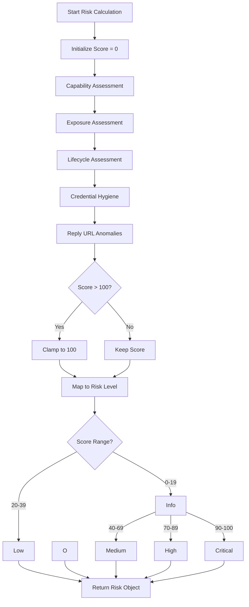
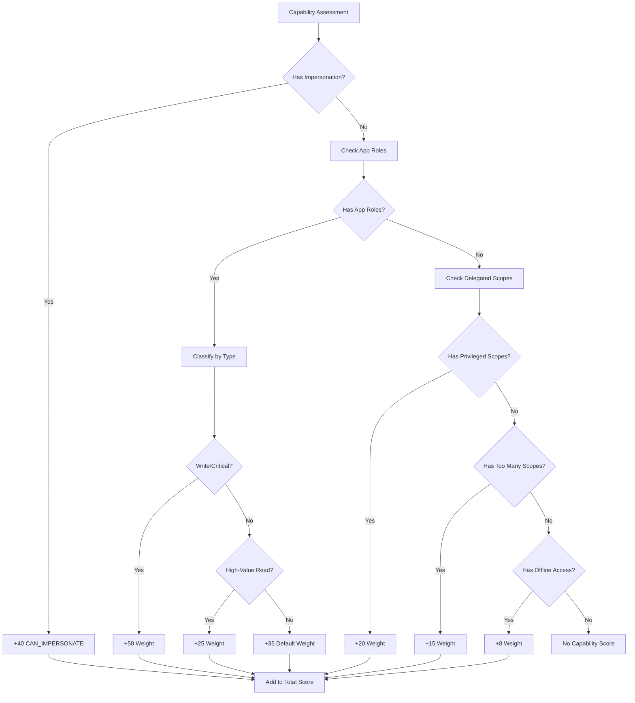
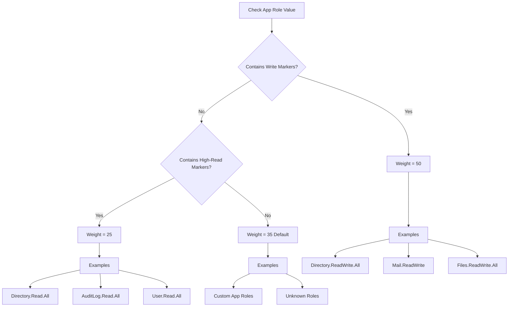
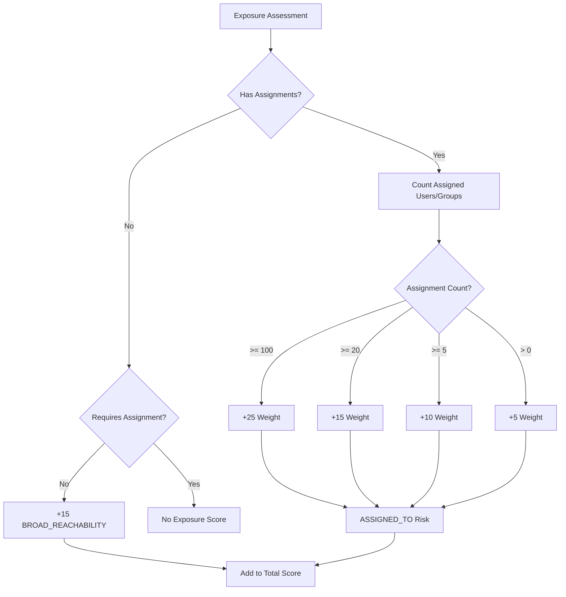
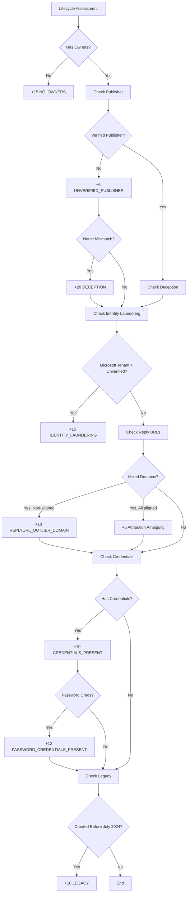
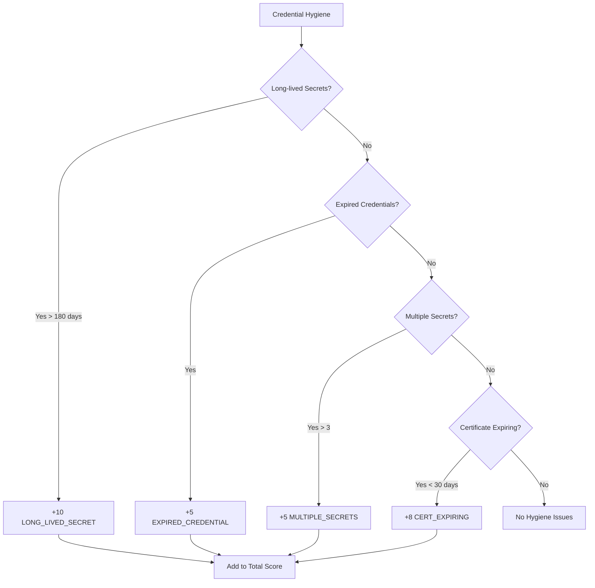
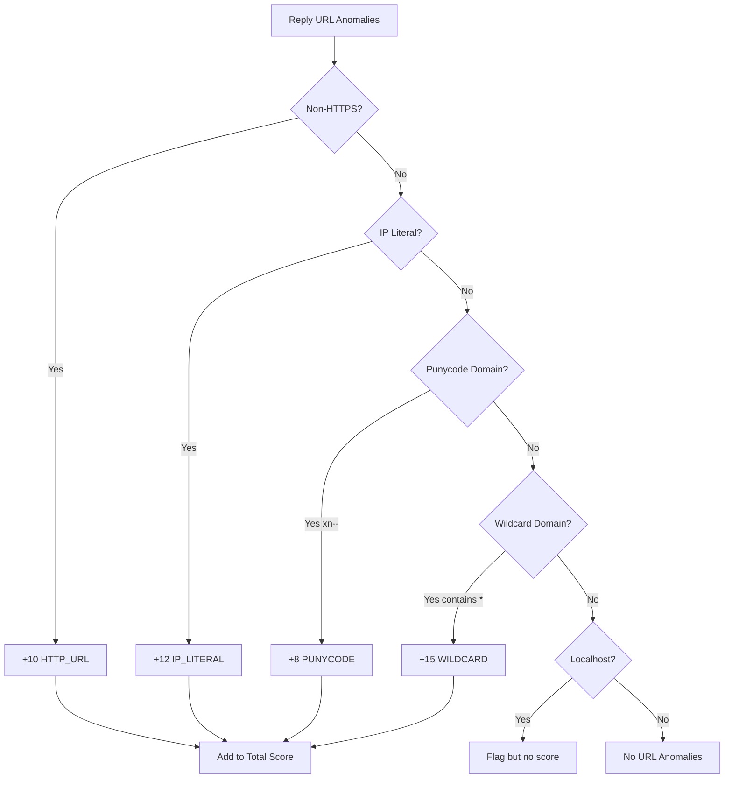
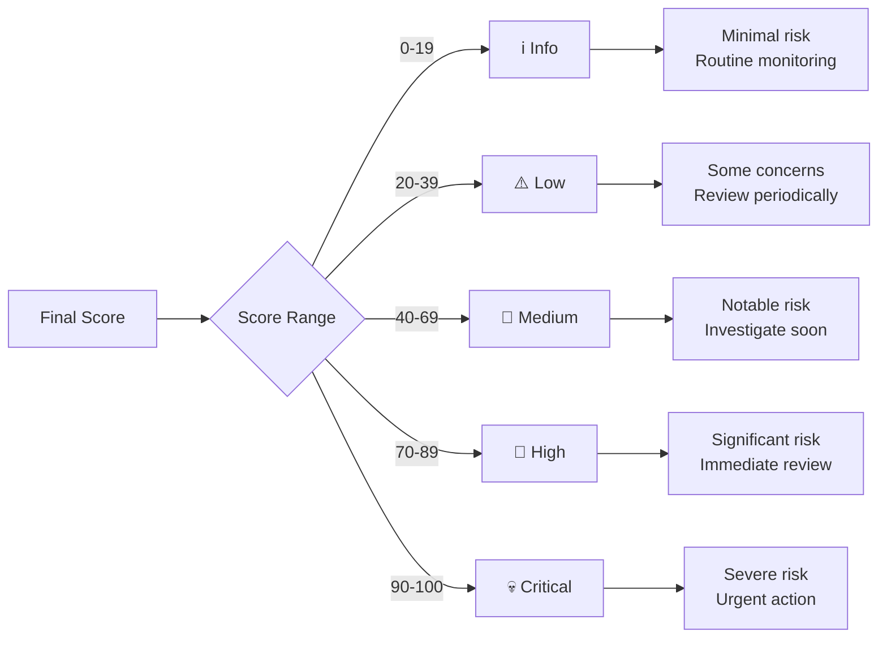

# OID-See Scoring Logic Documentation

## Overview

The OID-See scoring system provides comprehensive risk assessment for service principals and applications in your Entra ID tenant. Scores range from 0-100 and are mapped to risk levels: Info, Low, Medium, High, and Critical.

**Risk Reason Codes**: Each service principal's risk score includes a `reasons` array with specific risk contributors. Each reason has:
- `code`: The risk factor identifier (e.g., `NO_OWNERS`, `HAS_APP_ROLE`)
- `message`: Human-readable description
- `weight`: Points contributed to the total score

**Note**: Some risk codes in the export may differ from conceptual names in this documentation (e.g., `GOVERNANCE` in exports vs `BROAD_REACHABILITY` conceptually, or `OFFLINE_ACCESS_PERSISTENCE` vs `HAS_OFFLINE_ACCESS` edge type). Both are documented below.

## Scoring Algorithm



## Risk Categories

### 1. Capability Assessment

Evaluates what the application can do with its granted permissions.



#### CAN_IMPERSONATE (+40)

**Description**: Application has explicit delegated impersonation markers

**Triggers**:
- OAuth2 scope contains `access_as_user`
- OAuth2 scope contains `user_impersonation`

**Risk Rationale**: Apps with impersonation capability can act as the signed-in user, accessing resources on their behalf. This is the highest capability risk.

**Example**:
```json
{
  "code": "CAN_IMPERSONATE",
  "weight": 40,
  "message": "Delegated impersonation markers present (access_as_user/user_impersonation)"
}
```

#### HAS_APP_ROLE (35-50)

**Description**: Application has been granted application permissions (app roles)

**Weight Calculation**:


**Write Markers** (Weight: 50):
- `directory.readwrite`
- `directory.access`
- `rolemanagement.readwrite`
- `mail.readwrite`
- `files.readwrite`
- `sites.fullcontrol`
- `sites.readwrite`
- `group.readwrite`
- `reports.readwrite`
- `device.readwrite`
- `user.readwrite`

**High-Read Markers** (Weight: 25):
- `directory.read.all`
- `auditlog.read`
- `mail.read`
- `files.read`
- `sites.read`
- `group.read.all`
- `reports.read.all`
- `user.read.all`

**Risk Rationale**: Application permissions don't require user context and can access any resource in the tenant. Write permissions are more dangerous than read permissions.

#### HAS_PRIVILEGED_SCOPES (+20)

**Description**: Delegated scopes contain write or ReadWrite operations

**Detection**: Scope value contains `write` or `readwrite` (case-insensitive)

**Examples**:
- `User.ReadWrite.All`
- `Mail.ReadWrite`
- `Files.ReadWrite`

**Risk Rationale**: Write permissions allow modification of data, increasing abuse potential.

#### HAS_TOO_MANY_SCOPES (+15)

**Description**: Delegated consent is overly broad

**Detection**: Scope value ends with `.All`

**Examples**:
- `User.Read.All`
- `Mail.Read.All`
- `Calendars.Read.All`

**Risk Rationale**: `.All` scopes grant access to all resources of a type, not just the user's own data. This is "consent sprawl" - more access than typically needed.

#### OFFLINE_ACCESS_PERSISTENCE (+8 to +15)

**Description**: App can obtain refresh tokens for persistence

**Detection**: OAuth2 scope includes `offline_access`

**Risk Code**: `OFFLINE_ACCESS_PERSISTENCE` (in risk.reasons)

**Edge Type**: `HAS_OFFLINE_ACCESS` (in graph edges)

**Risk Rationale**: Refresh tokens allow apps to maintain access without user interaction, providing persistence. This is NOT impersonation - that's tracked separately via `CAN_IMPERSONATE`.

**Note**: The risk reason shows as `OFFLINE_ACCESS_PERSISTENCE` while graph edges use type `HAS_OFFLINE_ACCESS`.

### 2. Exposure Assessment

Evaluates how many users can access the application.



#### ASSIGNED_TO (5-25)

**Description**: Application is assigned to users/groups

**Weight Thresholds**:

| User Count | Weight | Risk Level |
|------------|--------|------------|
| 100+       | 25     | All users or very large groups |
| 20-99      | 15     | Large groups |
| 5-19       | 10     | Medium groups |
| 1-4        | 5      | Small groups |
| 0          | 0      | Not applied |

**Calculation Logic**:
```python
if assigned_count >= 100:
    weight = 25
elif assigned_count >= 20:
    weight = 15
elif assigned_count >= 5:
    weight = 10
elif assigned_count > 0:
    weight = 5
```

**Risk Rationale**: More assignments mean more potential victims if the app is compromised. Large group assignments amplify risk.

#### BROAD_REACHABILITY / GOVERNANCE (+5 to +15)

**Description**: App doesn't require assignment, making it broadly reachable

**Risk Codes**: 
- `GOVERNANCE` (+5): Used in current implementation when `appRoleAssignmentRequired = false`
- `BROAD_REACHABILITY`: Legacy/conceptual name for the same risk

**Triggers**:
- `appRoleAssignmentRequired = false` (or null)

**Risk Rationale**: Any user in the tenant can consent to and use the app. This is high exposure without explicit governance.

**Note**: If users/groups are explicitly assigned (`ASSIGNED_TO` applies), only the GOVERNANCE/BROAD_REACHABILITY base penalty applies, not cumulative with assignment scores.

### 3. Lifecycle Assessment

Evaluates organizational factors and app lifecycle.



#### NO_OWNERS (+15)

**Description**: Application or service principal has no owners

**Risk Rationale**: Ownerless apps lack accountability and may be orphaned or forgotten. No one is responsible for lifecycle management, credential rotation, or security reviews.

#### UNVERIFIED_PUBLISHER (+6)

**Description**: Publisher is not verified by Microsoft

**Detection**: `verifiedPublisher` is null or empty

**Risk Rationale**: Verified publishers have gone through Microsoft's verification process, providing some trust signal. Unverified publishers could be anyone.

#### DECEPTION (+20)

**Description**: Unverified publisher with significant name mismatch

**Triggers**:
- Publisher is unverified
- Display name and publisher name differ significantly
- App has reply URLs (capable of OAuth flows)

**Risk Rationale**: Deceptive naming can trick users into granting consent. Example: "Microsoft Office Portal" published by "john.doe@example.com".

**Gating**: Only applied when `total_urls > 0` (not for apps without OAuth capability).

#### IDENTITY_LAUNDERING (+15)

**Description**: App appears Microsoft-owned but is unverified

**Detection**:
- `appOwnerOrganizationId` matches known Microsoft tenant IDs
- Publisher is unverified
- Multi-tenant app

**Microsoft Tenant IDs**:
- `f8cdef31-a31e-4b4a-93e4-5f571e91255a` (Microsoft Accounts/MSA)
- `72f988bf-86f1-41af-91ab-2d7cd011db47` (Microsoft Services)

**Risk Rationale**: Attackers may try to make their apps appear as Microsoft services to gain trust.

#### MIXED_REPLYURL_DOMAINS (+5 or +15)

**Description**: Reply URLs use multiple distinct domains

**Identity Laundering Signal** (+15):
- Multiple distinct domains
- At least one domain NOT aligned with homepage/branding

**Example**:
```
Reply URLs: 
  - https://app.contoso.com/callback
  - https://evil-phishing.com/steal
Homepage: https://www.contoso.com
→ evil-phishing.com not aligned → +15
```

**Attribution Ambiguity** (+5):
- Multiple distinct domains
- All domains aligned with homepage/branding

**Example**:
```
Reply URLs:
  - https://app.contoso.com/callback
  - https://api.fabrikam.com/oauth
Homepage: https://www.contoso.com
Marketing URL: https://fabrikam.com
→ Both aligned → +5
```

**Risk Rationale**: Mixed domains can indicate phishing attempts (identity laundering) or legitimate multi-brand companies (attribution ambiguity).

**Enrichment Impact**: When enrichment is enabled, DNS/RDAP/WHOIS lookups can verify that multi-domain reply URLs belong to the same organization (via ASN/network ownership), reducing false positives for legitimate multi-domain vendors like Microsoft.

#### REPLYURL_OUTLIER_DOMAIN (+10)

**Description**: Reply URLs contain domains outside the main vendor domain set

**Detection**: Leverages the same domain analysis as `MIXED_REPLYURL_DOMAINS`, but specifically flags non-aligned domains.

**Risk Rationale**: Redirect to unexpected domains may indicate compromise or misconfiguration.

**Enrichment Impact**: When enrichment is enabled, ASN/network ownership verification can reduce false positives by confirming domains belong to the same organization.

#### CREDENTIALS_PRESENT (+10)

**Description**: Service principal has credentials (keys or passwords)

**Detection**: Any password credentials or key credentials present

**Risk Rationale**: Credentials indicate the app has persistence capabilities and potential for lateral reuse.

#### PASSWORD_CREDENTIALS_PRESENT (+12)

**Description**: Service principal has password credentials (client secrets)

**Detection**: Password credentials present

**Risk Rationale**: Password secrets are easier to exfiltrate and misuse than certificates. Higher risk than key credentials alone.

#### LEGACY (+10)

**Description**: Application was created before a security baseline date

**Detection**: `createdDateTime` before July 2024

**Risk Rationale**: Older apps may not follow modern security practices, may lack security reviews, or may be orphaned.

### 4. Credential Hygiene

Evaluates the security of application credentials.



#### Long-lived Secrets (+10)

**Description**: Password credentials with lifetime exceeding 180 days

**Risk Rationale**: Long-lived secrets increase the window of opportunity for compromise. Microsoft recommends shorter credential lifetimes.

**Best Practice**: Rotate secrets every 90 days or less.

#### Expired Credentials (+5)

**Description**: Expired credentials still present in configuration

**Risk Rationale**: Leftover expired credentials indicate poor credential hygiene and may confuse administrators or allow accidental usage.

**Best Practice**: Remove expired credentials promptly.

#### Multiple Active Secrets (+5)

**Description**: More than 3 active credentials present

**Risk Rationale**: Too many credentials increases the attack surface and management complexity.

**Best Practice**: Maintain 2 credentials (active + rollover) at most.

#### Certificate Expiring Soon (+8)

**Description**: X.509 certificates expiring within 30 days

**Risk Rationale**: Expiring certificates can cause service outages. Advance warning allows planned rotation.

**Best Practice**: Set up alerts at 60 days and rotate at 30 days before expiry.

### 5. Reply URL Anomalies

Evaluates security of OAuth2 redirect URIs.



#### Non-HTTPS URLs (+10)

**Description**: Reply URLs using HTTP instead of HTTPS

**Example**: `http://app.contoso.com/callback`

**Risk Rationale**: HTTP is unencrypted. Authorization codes and tokens could be intercepted.

**Best Practice**: Always use HTTPS for OAuth redirect URIs.

#### IP Literal Addresses (+12)

**Description**: Reply URLs contain IP addresses

**Examples**:
- `https://192.168.1.100/callback`
- `https://[2001:db8::1]/callback`

**Risk Rationale**: IP addresses can bypass domain validation and DNS security controls. May indicate testing configurations in production.

**Best Practice**: Use proper domain names with TLS certificates.

#### Punycode Domains (+8)

**Description**: Reply URLs contain internationalized domain names (IDN)

**Detection**: Domain contains `xn--` prefix

**Example**: `https://xn--80akhbyknj4f.com/callback` (Cyrillic characters)

**Risk Rationale**: Punycode can be used for homograph attacks, where domain names look similar to legitimate domains but use different characters.

**Best Practice**: Be cautious with IDN domains. Validate they belong to your organization.

#### Wildcard Domains (+15)

**Description**: Reply URLs contain wildcard domains

**Example**: `https://*.contoso.com/callback`

**Risk Rationale**: Wildcards match any subdomain, significantly expanding the attack surface. An attacker who can control any subdomain can receive authorization codes.

**Best Practice**: Use explicit subdomains instead of wildcards.

## Risk Level Mapping



### Risk Level Descriptions

#### Info (0-19)
- **Severity**: Informational
- **Action**: Routine monitoring
- **Description**: Minimal risk factors present. Application appears well-configured.

#### Low (20-39)
- **Severity**: Low
- **Action**: Review periodically
- **Description**: Some minor concerns. May have basic permissions or single risk factor.

#### Medium (40-69)
- **Severity**: Medium
- **Action**: Investigate soon
- **Description**: Multiple risk factors or moderate capability. Warrants attention.

#### High (70-89)
- **Severity**: High
- **Action**: Immediate review required
- **Description**: Significant risk factors present. High capability or exposure, minimal governance.

#### Critical (90-100)
- **Severity**: Critical
- **Action**: Urgent action required
- **Description**: Severe risk. Multiple high-impact factors or extreme capability without governance.

## Score Calculation Example

### Scenario: Suspicious Third-Party App

**Application Details**:
- Name: "Office Management Portal"
- Publisher: Unverified
- Permissions: `User.ReadWrite.All`, `Mail.ReadWrite`
- App Roles: `Directory.Read.All`
- Assignments: Broad reachability (no assignment required)
- Reply URLs: `https://app.example.com`, `https://phishing-site.com/callback`
- Credentials: 1 password secret (400 days old)
- Owners: None
- Governance: None

**Score Calculation**:

```
Capability:
  HAS_APP_ROLE (Directory.Read.All high-read)     +25
  HAS_PRIVILEGED_SCOPES (ReadWrite)               +20
  HAS_TOO_MANY_SCOPES (.All suffix)               +15

Exposure:
  BROAD_REACHABILITY (no assignment required)     +15

Governance & Lifecycle:
  NO_OWNERS                                       +15
  UNVERIFIED_PUBLISHER                            +6
  DECEPTION (name mismatch)                       +20
  REPLYURL_OUTLIER_DOMAIN (phishing-site.com)    +10
  CREDENTIALS_PRESENT                             +10
  PASSWORD_CREDENTIALS_PRESENT                    +12

Credential Hygiene:
  LONG_LIVED_SECRET (400 days)                    +10

Total: 158 → Clamped to 100 → CRITICAL
```

**Risk Reasons**:
```json
[
  {"code": "HAS_APP_ROLE", "weight": 25, "message": "Application permissions granted"},
  {"code": "HAS_PRIVILEGED_SCOPES", "weight": 20, "message": "Privileged delegated scopes"},
  {"code": "HAS_TOO_MANY_SCOPES", "weight": 15, "message": "Overly broad consent"},
  {"code": "BROAD_REACHABILITY", "weight": 15, "message": "No assignment required"},
  {"code": "NO_OWNERS", "weight": 15, "message": "No owners assigned"},
  {"code": "UNVERIFIED_PUBLISHER", "weight": 6, "message": "Unverified publisher"},
  {"code": "DECEPTION", "weight": 20, "message": "Name mismatch with unverified publisher"},
  {"code": "REPLYURL_OUTLIER_DOMAIN", "weight": 10, "message": "Reply URLs use non-aligned domains"},
  {"code": "CREDENTIALS_PRESENT", "weight": 10, "message": "Credentials present on SP"},
  {"code": "PASSWORD_CREDENTIALS_PRESENT", "weight": 12, "message": "Password credentials present"},
  {"code": "LONG_LIVED_SECRET", "weight": 10, "message": "Secret lifetime exceeds 180 days"}
]
```

### Scenario: Well-Governed Enterprise App

**Application Details**:
- Name: "Contoso HR Portal"
- Publisher: Verified
- Permissions: `User.Read`, `offline_access`
- Assignments: 25 users (HR group)
- Reply URLs: `https://hr.contoso.com/callback`
- Credentials: Certificate (expires in 90 days)
- Owners: 2 admins

**Score Calculation**:

```
Capability:
  HAS_OFFLINE_ACCESS                              +8

Exposure:
  ASSIGNED_TO (25 users)                          +15

Lifecycle:
  (No negative factors)                           +0

Credential Hygiene:
  (No issues)                                     +0

Reply URL Anomalies:
  (No issues)                                     +0

Final Score: 23 → LOW
```

**Risk Reasons**:
```json
[
  {"code": "HAS_OFFLINE_ACCESS", "weight": 8, "message": "Persistence via refresh tokens"},
  {"code": "ASSIGNED_TO", "weight": 15, "message": "Assigned to 25 users"}
]
```

## Configuration

The scoring logic is configured in `scoring_logic.json`. This file contains:

1. **App Role Classification**: Weight mappings for different app role types
2. **Scope Classification**: Rules for categorizing delegated scopes
3. **Risk Contributors**: Weights and descriptions for each scoring factor

### Customizing Weights

To adjust risk weights, edit `scoring_logic.json`:

```json
{
  "compute_risk_for_sp": {
    "scoring_contributors": {
      "CAN_IMPERSONATE": {
        "weight": 40,
        "description": "Delegated impersonation markers present"
      },
      "DECEPTION": {
        "weight": 20,
        "description": "Unverified publisher with name mismatch"
      }
      // ... other contributors
    }
  }
}
```

**Note**: Weight changes apply on next scanner run. Existing exports use the weights from when they were generated.

## Best Practices

### 1. Regular Scanning
- **Frequency**: Weekly or bi-weekly
- **Purpose**: Track changes and new risks over time

### 2. Focus on High/Critical
- **Priority**: Address critical and high-risk apps first
- **Investigation**: Review permissions, ownership, and credentials

### 3. Ownership Management
- **Assign Owners**: Ensure all apps have proper ownership
- **Effect**: Prevents +15 point NO_OWNERS penalty

### 4. Credential Hygiene
- **Review**: Check for long-lived and expired secrets
- **Rotate**: Establish regular rotation schedule (90 days recommended)

### 5. Verified Publishers
- **Verification**: Work with vendors to get publisher verification
- **Effect**: Reduces base risk by 6 points and prevents DECEPTION scoring

### 6. Ownership
- **Assignment**: Ensure all apps have designated owners
- **Accountability**: Owners are responsible for lifecycle and security

### 7. Least Privilege
- **Permissions**: Review and reduce unnecessary permissions
- **Impact**: Can reduce scores by 15-50 points depending on changes

## Risk Score Interpretation

### What the Score Means

The risk score is an **indicator**, not a verdict:

- **High Score**: App has multiple risk factors that increase potential for abuse
- **Low Score**: App appears well-configured with appropriate controls
- **Context Matters**: Consider business purpose and user population

### What the Score Doesn't Mean

- **Not a Security Guarantee**: Low scores don't mean an app is safe
- **Not a Ban List**: High scores don't automatically mean an app is malicious
- **Not Compliance**: Scores don't represent regulatory compliance status

### Using Scores Effectively

1. **Prioritization**: Focus security reviews on high-risk apps
2. **Trend Analysis**: Track score changes over time
3. **Governance Validation**: Verify that governed apps have lower scores
4. **Exception Handling**: Document and accept risk for legitimate high-scoring apps

## Microsoft-Specific Scoring Considerations

### Expected Patterns for Microsoft Apps

Microsoft service principals often exhibit patterns that might appear as risk factors but are expected for first-party services:

**Multi-Domain Reply URLs**:
- Microsoft apps frequently have reply URLs across multiple Microsoft-owned domains
- Examples: login.microsoftonline.com, login.windows.net, aadcdn.msauth.net
- When enrichment is enabled, ASN verification confirms these belong to Microsoft infrastructure
- Without enrichment, these may be flagged with `MIXED_REPLYURL_DOMAINS` or `REPLYURL_OUTLIER_DOMAIN`

**Wildcard Reply URLs**:
- Some Microsoft apps use wildcard domains (e.g., `*.office.com`, `*.sharepoint.com`)
- This is expected for apps serving multiple subdomains
- Still flagged for visibility but context indicates legitimate use

**Verified Publisher Status**:
- Microsoft first-party apps should have verified publishers
- Apps from known Microsoft tenant IDs without verification trigger `IDENTITY_LAUNDERING` detection
- Use Merill's Microsoft Apps list (integrated in scanner) to identify legitimate first-party apps

**High Permissions**:
- Microsoft Graph, Exchange Online, SharePoint, and other resource APIs naturally have high permissions
- These are expected and necessary for platform functionality
- Focus investigation on third-party apps with similar permission levels

### Broker Schemes

Mobile applications using broker schemes are not penalized:
- **msauth://**, **ms-app://**, **brk-*://**: Recognized as legitimate mobile patterns
- Tracked in `replyUrlAnalysis.schemes` for visibility
- Do not contribute to risk scores

### Enrichment Benefits for Microsoft-Heavy Tenants

Tenants with many Microsoft apps benefit from enrichment:
- ASN/network ownership verification reduces false positives for multi-domain Microsoft apps
- RDAP data confirms infrastructure ownership patterns
- DNS lookups verify expected domain relationships

**Recommendation**: Enable enrichment for tenants with significant Microsoft app presence to improve scoring accuracy.

## Related Documentation

- **[Scanner Documentation](scanner.md)**: How risk data is collected
- **[Schema Documentation](schema.md)**: Structure of risk objects in exports
- **[Web App Documentation](webapp.md)**: Visualizing and filtering by risk scores
